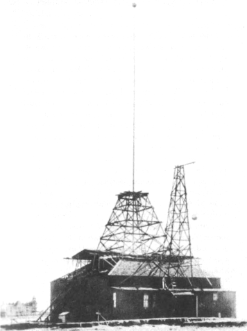
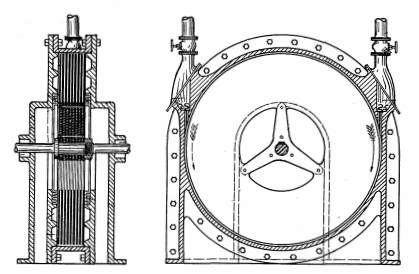
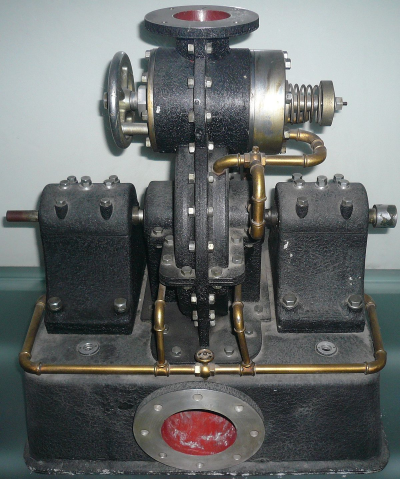
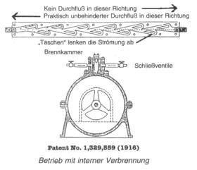

+++
title = "Die Scheibenläuferturbine"
chapter = "01"
weight  = 300
+++
# Die Scheibenläuferturbine




Tesla nannte sie das "Kraftwerk in einem Hut". In einer Version entwickelte sie eine Leistung von über 80kW bei 5000 Umdrehungen je Minute; sie hatte einen Durchmesser von etwa 250 mm. Nach Meinung Teslas könnten größere Turbinen 800kW und mehr erreichen.

Die Scheibenläuferturbine arbeitet vibrationsfrei. Sie ist billig herzustellen, da kein Teil außer den Rotorlagern eng toleriert sein muss. Sie benötigt nur wenig Wartung. Falls erforderlich, lässt sich der Rotor auf einfache Weise auswechseln. Die Turbine kann mit Dampf, Druckluft, Benzin oder Öl laufen. 

 

## Funktionsweise 

 


Im Unterschied zu herkömmlichen Turbinen, bei denen das strömende Medium auf blatt- oder korbartig geformte Schaufeln trifft, verwendet Tesla einen Satz starrer Metallscheiben. Diese stehen nicht in einem stumpfen Winkel quer zur Strömung, sondern drehen sich auf natürliche Weise parallel zu ihr. Die Drehbewegung der Scheiben wird durch die zwischen der Oberfläche eines Körpers und einem fließenden Medium auftretende spezielle Adhäsionskraft verursacht.

Diese Adhäsionskraft, die z.B. bei Flugzeugen eher hinderlich ist, resultiert nach Teslas Worten aus "den Kräften, die die Flüssigkeit auf die Oberflächenrauhigkeiten des festen Materials ausübt" (einfacher Reibungswiderstand) und aus den "internen Kräften, die der molekularen Scherung widerstehen" (Bindungskräfte).

Das Antriebsmedium strömt durch die Eintrittsöffnung und wird auf die äußeren Ränder der Scheiben gerichtet. Es wandert in spiralförmiger Bewegung über die sich drehenden Scheiben zu den in Scheibenmitte angeordneten Öffnungen, durchfließt diese und tritt an der Auslassöffnung des Gehäuses aus.

Tesla vermerkt in der Patentschrift, dass in einer von einer Flüssigkeit angetriebenen Maschine "Veränderungen der Geschwindigkeit und der Richtung des Flüssigkeitsstroms so sanft wie möglich stattfinden sollten". Dies ist jedoch nach seiner Feststellung in den üblichen Maschinen nicht der Fall; dort "sind plötzliche Veränderungen, Stöße und Vibrationen unvermeidbar".

"Die Benutzung von Kolben, Flügeln, Klappen, Schaufeln und dergleichen", so Teslas Ausführungen, "bewirkt notwendigerweise zahlreiche Nachteile und Einschränkungen und trägt zu Verkomplizierungen sowie zur Erhöhung der Produktions- und der Wartungskosten der Maschinen bei." Wir, die wir immer noch an der Kolbenmaschine festhalten, wissen dies nur zu genau. Die Tesla-Turbine ist vibrationsfrei, da sich die Antriebsflüssigkeit "entlang natürlicher Bahnen oder Strömungslinien des geringsten Widerstands, frei von Behinderungen oder Störungen" bewegt.

Durch Vertauschen der Eintrittsmit der Austrittsöffnung lässt sich die Drehrichtung der Turbine ganz einfach umkehren.

## Verbrennungskraftmaschine
Als Brennkammer wird oben auf der Turbine ein Gehäuse angebracht. In die Brennkammer wird eine Glüh- oder eine Zündkerze eingesetzt. Seitlich an der Brennkammer werden Einlassventile angeordnet. Das Interessante an diesen Ventilen ist, dass sie keine beweglichen Teile enthalten. Sie arbeiten nach dem Fluidik-Prinzip. Das einzige bewegliche Teil der Tesla-Turbine ist der Rotor oder Läufer. Es handelt sich demnach um eine leistungsfähige Verbrennungskraftmaschine mit nur einem beweglichen Teil! 

## Fluidik-Ventil 




Das Fluidik-Ventil, von Tesla als Strömungsrichter bezeichnet, ermöglicht den unbehinderten Durchfluss in einer Richtung. In der anderen Richtung wird die Strömung durch Sackkammern unterbunden. Die Strömung wird dort um 360 Grad umgelenkt und bildet dadurch Wirbel oder Gegenströmungen, so dass das Medium genauso sicher blockiert wird wie durch Schließen eines mechanischen Ventils. 

Durch den vom umlaufenden Rotor erzeugten Sog werden ausreichend Brennstoff und Luft in die Brennkammer gefördert. Laut Tesla ist "nach kurzer Zeit die Brennkammer so stark erhitzt, dass die Zündvorrichtung abgeschaltet werden kann, ohne dass sich der Betriebszustand verändert". Mit anderen Worten, die Turbine dieselt dann weiter (Selbstzündung). 

Die Tesla-Turbine kann im Umkehrbetrieb auch sehr effizient als Pumpe eingesetzt werden (Tesla-Patent Nr. 1.061.142). Diese Anwendung wird heute auch großtechnisch z.B. bei Schlammpumpen genutzt. 

## Flüssigkeitsantriebe 
Das Prinzip der Scheibenläuferturbine kann zur Drehzahlmessung benutzt werden. Dort besteht das Problem darin, eine Drehbewegung, z.B. von Fahrzeugrädern, in eine Winkelbewegung umzusetzen, um einen Zeiger entgegen der Kraft einer Feder zu verstellen. Der Vorschlag von Tesla: Die Drehzahlmesserwelle treibt eine gegenüber einer zweiten Scheibe angeordneten Scheibe an. Die Drehbewegung wird durch eine Flüssigkeit auf die zweite Scheibe übertragen, und diese bewegt den Zeiger.

Durch Anordnung zweier Scheiben unterschiedlicher Größe in einem flüssigen Medium lässt sich "bei entsprechender Wahl der Scheibendurchmesser jedes beliebige Verhältnis zwischen den Rotationsgeschwindigkeiten erreichen", vermerkt Tesla in seiner Patentschrift; somit nimmt er bereits 1911 die Idee zum Flüssigkeits-Automatikgetriebe vorweg. 

Tesla arbeitete schon früh in seiner Karriere an dieser Turbine. Er betrachtete sie als sehr geeigneten Antrieb für seine Wechselstromgeneratoren und glaubte sie den Kolbendampfmaschinen, den Arbeitspferden der damaligen Zeit, weit überlegen. Er kam aber erst nach dem Zusammenbruch seiner Pläne eines weltweiten Rundfunksystems (1909) dazu, sie zu perfektionieren und zu patentieren. Zu dieser Zeit war aber der Kolbenmotor mit interner Verbrennung als Antriebsmaschine in der westlichen Technik nicht mehr zu verdrängen. Tesla sprach im Zusammenhang mit seinen Anstrengungen zur Einführung seiner Turbine von "organisierter Opposition", ebenso wie andere, die ihm seither dabei nachfolgten. 

Tesla sah für seine Turbine trotzdem immer noch eine glorreiche Zukunft. Gegenüber seinem Freund, dem Professor und Ingenieur Charles Scott von der Universität Yale, sagte er voraus, dass "meine Turbine alle Wärmekraftmaschinen der Welt zu Schrott machen wird". Scott erwiderte: "Dies würde aber einen ziemlichen Schrottberg entstehen lassen." Und das war wohl der Punkt, warum die Entwicklung bisher nicht stattgefunden hat. 

---

## Bibliographie
Die Patentschrift ist wie die anderen im Buch erwähnten Patentschriften unter Angabe der Patentnummer vom U.S. Patent Office, Washington, DC 20231, zum Preis von $ 1,50 erhältlich. 

Die US-Patente von Tesla sind zusammengefaßt wiedergegeben in: 
 - Nikola Tesla: Complete Patents; Herausg. John Ratzlaff, Vertrieb Tesla Book Co. 
 - Lectures, Patents, Articles Herausg. Vojin Popovich; Tesla Museum, Vertrieb Tesla Book Co. 

Mit handwerklichem Geschick kann eine Scheibenläuferturbine auch selbst gebaut werden; detaillierte Zeichnungen sind zu finden im: 
- „Live Steam Magazine", Nov. 1984 (R. S. Heden: „The Tesla Turbine") 

- Über einen jüngeren Versuch zur Einführung der Tesla-Turbine wird in „The Spotlight" von 30. April 1984 in einem Artikel von Tom Valentine berichtet. 

- Im Heft 2/1992 des Magazins Extraordinary Science der International Tesla Society werden die 	DISCFLO-Pumpen als technologischer Quantensprung beschrieben. 

