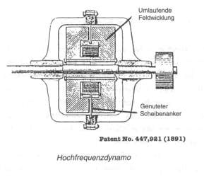
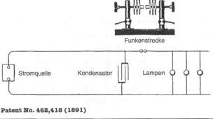
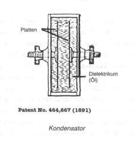
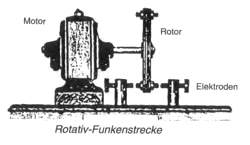

+++
title = "Der Funkenstrecken-Oszillator"
chapter = "02"
weight  = 400
+++
# Der Funkenstrecken-Oszillator 




Tesla war bei der Einrichtung des heute noch bestehenden 60Hz-Netzes an führender Stelle beteiligt. Er vermutete jedoch, dass die wirkungsvolleren Phänomene im höheren Frequenzbereich zu Hause sind. Um diese höheren Frequenzen zu erzeugen, unternahm er zunächst Versuche, bei denen er die Generatoren (Dynamos) mit höheren Drehzahlen betrieb und sie mit mehr Polen als bis dahin üblich versah. Einer der Generatoren mit einer flachen, genuteten Kupferscheibe als Anker (Rotor) erreichte 30.000 Schwingungen pro Sekunde (Hz); Tesla wollte jedoch in den Bereich von Millionen von Schwingungen pro Sekunde (Megahertz, MHz) gehen.

 





Er kam auf die Idee, dass die Möglichkeit zur Erreichung derartig hoher Frequenzen durch Verwendung von Kondensatoren erreichbar wäre. Mit einer bestimmten Kondensator-Anordnung, dem Funkenstrecken-Oszillator, erreichte er tatsächlich höhere Frequenzen, und zwar ganz ohne mechanisch bewegliche Teile. Diese Schaltungsanordnung schien ihm so vielversprechend, dass er sie als "Methode und Vorrichtung zur elektrischen Umwandlung und Verteilung" patentieren ließ, da er in ihr die Möglichkeit für ein völlig neuartiges elektrisches Beleuchtungssystem unter Verwendung hoher Frequenzen sah. Wenngleich der Funkenstrecken-Oszillator bald von der Tesla-Spule überholt wurde und nicht unter den bekannteren der verschollenen Erfindungen aufgeführt ist, so bezeichnet er für Tesla doch eine Wendemarke, da diese Erfindung dessen Karriere im Hochfrequenzbereich einleitete. 

## Der Kondensator




Elektrische Schaltungen bestehen aus nur wenigen Grundbausteinen. Einer davon ist der Kondensator. Tesla hat ihn nicht erfunden; er war schon bekannt, angeblich seit Jahrtausenden, aber Tesla hat ihn in drei seiner Patente verbessert. Der gewöhnliche Kondensator besteht lediglich aus einigen Schichten leitender und nichtleitender Materialien; er hat den Zweck, elektrische Ladungen zu speichern. Der einfachste Kondensator weist zwei leitfähige Platten auf, die durch eine isolierende Platte getrennt sind. Im abgebildeten Kondensator sind die leitenden Elemente zwei Metallplatten. Als Isolation dazwischen wird Öl verwendet. In der Fachsprache heißen die Platten tatsächlich "Platten" oder auch "Beläge" (je nach Ausführung); die isolierende Schicht (Öl, Glas, Glimmer oder anderes) ist das "Dielektrikum". 

Wenn die beiden Anschlüsse eines Kondensators an eine Schaltung mit positivem und negativem elektrischem Potential angeschlossen werden, baut sich auf den Platten eine Ladung auf, positiv auf der einen und negativ auf der anderen Platte. Wenn man eine Zeit lang abwartet, bis sich die Ladung aufgebaut hat, und dann die beiden Platten über einen Widerstand, z.B. eine Spule, miteinander verbindet, entlädt sich der Kondensator, und zwar sehr plötzlich. Tesla sagte, daß "die Explosion von Dynamit nur ein vorübergehender Hauch im Vergleich zur Entladung eines Kondensators" sei. Er sagte weiter, der Kondensator wäre "das Mittel zur Erzeugung der stärksten Ströme, des höchsten elektrischen Drucks, des größten Aufruhrs im Medium".

Eine Kondensatorentladung ist nicht unbedingt ein Einzelvorgang. Falls sich der Kondensator über einen geeigneten Widerstand entlädt, erfolgt ein Stromstoß in der einen Richtung, dann zurück, als ob der Strom abprallen würde, anschließend wieder hin und zurück und so weiter, bis sich das Ganze langsam totgelaufen hat. Die Entladung ist ein Schwingungsvorgang, eine Vibration. Er kann durch Nachladen des Kondensators zu geeigneten Zeitpunkten aufrechterhalten werden. Wenn Tesla davon spricht, dass die Entladung des Kondensators "Aufruhr im Medium" bewirkt, meint er damit Schwingungen oder ein Gemisch von Schwingungen. 

Das Wesen dieser Schwingungen oder Vibrationen wird zum Teil durch die Kapazität des Kondensators, das heißt durch sein Fassungsvermögen für die Ladung, bestimmt. Diese ist eine Funktion der Abmessungen der Platten und des Abstands zwischen ihnen sowie der Zusammensetzung des Dielektrikums. Bei der Entladung treten im Regelfall außer der Grundschwingung einige harmonische (Oberschwingungen) und möglicherweise andere Schwingungen, eventuell regelmäßiger Natur, auf. Durch weitere Schaltungselemente können die Schwingungen gezähmt werden, so dass ein "reiner" Ton entsteht. 

## Das "Medium"

Wenn Tesla von "Aufruhr im Medium" spricht, was meint er dann mit "Medium" ? 

Zu Teslas Zeiten besagte ein Glaubenssatz, dass ein alles durchdringendes einheitliches Feld, der "Äther", bestünde. An dem Äther als das elektrische Medium wird in manchen Kreisen immer noch festgehalten; in der offiziellen Wissenschaft gilt sein Vorhandensein jedoch als im Labor widerlegt. Nichtsdestotrotz war die Überzeugung, dass ein Äther vorhanden sei, sehr tief verwurzelt, und nicht nur bei Wissenschaftlern, sondern auch bei allen Denkern, bis vor nunmehr kaum mehr als fünfzig Jahren die Teilchentheorie mit der Gleichung E = mc² und schließlich Hiroshima den "neuen Glauben" fest verankerten. In den letzten Jahren zeigt sich wieder, dass das Konzept des Äthers sich als äußerst tragfähig erweist. Auch neueste Ansätze kommen hierauf zurück. 

Tesla sagte, das Elektron würde nicht existieren. Das materialistische Konzept, nach dem sich solche kleinen Teilchen durch die Leiter bewegen, ist Teslas Theorie der Elektrizität fremd. 

Hier die Ansicht, die der Quäker Rufus Jones 1920 über den Äther äußerte: "Eine ungreifbare Substanz, die wir Äther nennen luminoferoser (lichttragender) Äther erfüllt den gesamten Raum, auch den von sichtbaren Objekten eingenommenen Raum; dieser Äther, der erstaunlicher Schwingungen fähig ist, Milliarden von Schwingungen pro Sekunde, wird von unterschiedlichen Objekten in Schwingungen oder Vibrationen unterschiedlicher Geschwindigkeiten versetzt. Diese Vibrationen bombardieren die winzigen Zäpfchen der Regenbogenhaut. ... Er ist auch für all die ungeheuer vielfältigen Erscheinungen der Elektrizität, wahrscheinlich auch für die Kohäsion und die Gravitation, verantwortlich. ... Der Dynamo und die anderen von uns erfundenen elektrischen Geräte schaffen oder erzeugen keine Elektrizität. Sie lassen sie lediglich zum Vorschein kommen, wobei sie sich einmal in der Form von Licht, einmal in der Form von Wärme, einmal in der Form von Antriebskraft zeigt. Aber die Elektrizität war stets vorher vorhanden, unbemerkt, lediglich potentiell, und doch als weiter, hinter allem befindlicher, alles umhüllender Ozean voller Energie, jederzeit verfügbar zur Aktivierung, sobald das geeignete Medium vorhanden ist." 

Jones, der kein Wissenschaftler, sondern ein religiöser Denker und Verkünder war, betonte besonders die Nähe von Gottes Kräften; dabei half ihm die Berufung auf die Physik seiner Zeit. Heutzutage, bei der in Mode befindlichen und von W. Gordon Allen als "atheistische Wissenschaft" bezeichneten Einstein'schen Physik wäre dies schwierig. Dass Einstein später durchaus ein Verfechter des Äther-Modells war, wird ignoriert (vgl. "Forschung in Fesseln"). 

Wenngleich der Äther ungreifbar ist, so soll er doch elastische Eigenschaften besitzen, so dass Tesla sagen kann: "Ein Schaltkreis mit einer großen Kapazität verhält sich wie eine schlaffe Feder, während einer mit einer kleinen Kapazität wie eine steife Feder wirkt und heftiger vibriert." 

Diese Elastizität des Äthers zeigt sich greifbar z.B. beim Herumspielen mit Magneten; sie ist auf den Drang des Mediums zum Gleichgewicht zurückzuführen. Wenn der Äther durch eine elektrische Ladung (oder durch Magnetismus oder die Gravitation eines materiellen Körpers) verzerrt wird, versucht er, das ungestörte Gleichgewicht zwischen den Polaritäten Plus/Minus, Positiv/Negativ, Ying/Yang wiederherzustellen. Eine elektrische Spannung ist das Maß für eine Verzerrung oder ein Ungleichgewicht, die Potentialdifferenz oder schlicht Potential genannt wird. 

Das Gleichgewicht wird nicht lediglich durch ein einziges Zurückfedern aus dem Verzerrungszustand wiedergewonnen. Wie am Beispiel des Kondensators zu sehen ist, bewegt sich das verzerrte elektrische Medium über die Gleichgewichtslinie nach der anderen Seite hinaus, dann zurück und immer wieder hin und her; dieser Vorgang "wird als Schwingung bezeichnet. 

Wenn man die Natur auf diese Weise betrachtet, sind Schwingungen gleich Energie und ist Energie gleich Schwingung. Man könnte deshalb sagen, dass der durch die Entladung des Kondensators bewirkte Aufruhr im Medium Energie an sich darstellt. Somit kann man vom Kondensator als von einem Energieverstärker sprechen. Auch wenn er durch ein schwaches Potential aufgeladen wurde, wird das Medium durch die plötzliche Entladung des Kondensators machtvoll angestoßen. 

Der Kondensator ist ein in der modernen Schaltungstechnik allgemein übliches Element. Tesla benutzte ihn jedoch mit viel mehr Schwergewicht auf seiner Eigenschaft als Energieverstärker und in einem Maß, das heutzutage fast unbekannt ist. Es ist schwierig, handelsübliche Kondensatoren nach Teslas Spezifikationen zu finden. Die Erbauer von Tesla-Spulen und anderen Hochspannungsgeräten müssen gewöhnlich ihre Kondensatoren selbst anfertigen. Zum Glück kann dies unter Verwendung leicht erhältlicher Materialien geschehen. 

## Die Funkenstrecke 




Eine einfache Möglichkeit zur Entladung von Kondensatoren ist die Verwendung einer Funkenstrecke. Der Funkenstrecken-Oszillator besteht lediglich aus einem Kondensator, der seine Energie über eine Funkenstrecke durch die Last (eine Lampe oder dergleichen) entlädt. Die Weite des Spalts zwischen den Elektroden der Funkenstrecke bestimmt den Moment der Entladung. Sie ist eine der bestimmenden Größen für die Frequenz des Schaltkreises. Die anderen Größen sind die Kapazität und die Reaktanz, oder die "Prell"-Charakteristika, der Last. Das Potential zur Überbrückung des Spalts beträgt zehntausende Volt. Zur Überwindung des Widerstands eines Spalts von lediglich 6 mm in Luft sind etwa 20.000 Volt erforderlich. Im Spalt muss sich nicht unbedingt Luft befinden. Tesla sagte, dass der Spalt aus einer "isolierenden Schicht" bestünde. 

 





Eine Funkenstrecke ist in Wirklichkeit eine Schaltvorrichtung, ein Halbleiter. Aber die Ausformung des Spalts ist problematisch, insbesondere die des üblichen Luftspalts mit zwei Elektroden. Erhitzung und Ionisierung der Luft verursachen Unregelmäßigkeiten in der Leitfähigkeit und vorzeitigen Funkenübersprung. Derartige Lichtbogenbildungen müssen verhindert werden. Dies kann weitgehend durch Verwendung einer hintereinandergeschalteten Reihe kleiner Luftspalte statt eines großen Luftspalts oder durch Verwendung einer rotierenden Funkenstrecke geschehen. Tesla tauchte den Luftspalt auch in strömendes Öl oder er benutzte ein Gebläse; er fand sogar heraus, daß ein Magnetfeld hilfreich sein kann. Er ersetzte die Funkenstrecke schließlich durch mit hoher Drehzahl umlaufende Rotationsschalter. Einer dieser Schalter besitzt einen in Quecksilber eintauchenden Rotor, während der Kontakt bei einem anderen durch einen Quecksilberstrahl hergestellt wurde. 

Eine Funkenstrecke lässt sich auch ohne Kondensator betreiben, indem sie direkt an eine Quelle mit genügend hoher Spannung angeschlossen wird. So funktionieren beispielsweise die Zündkerzen in Automotoren, nämlich mit direkter Versorgung aus der Zündspule (der Kondensator in diesem Schaltkreis dient dazu, die Spannung in der Primärwicklung hochzutreiben). Der Verteiler hingegen arbeitet mit rotierendem Luftspalt, exakt nach Tesla. 

Die ersten Funkamateure verwendeten Funkenstrecken-Oszillatoren als Sender. Der Kondensator wurde zwar im Regelfall weggelassen, doch mit Kondensator konnte der Sender einen höheren "Aufruhr im Medium" erzeugen, was einer größeren Leistung gleichkommt. 

---

## Bibliographie
Angaben  zur Anfertigung von Kondensatoren und Funkenstrecken sind zu finden in: 
- George Trinkaus: Tesla Coil 
- R.A. Ford: Tesla Coil Secrets 
Einzelheiten über diese Titel enthält die Bibliographie des nächsten Kapitels. 

