+++
title = "Vorträge in London 1892"
description = "Vorträge gehalten in London im Institute of Electrical Engineers am 3. Februar 1892 und im Royal Institute am 4. Februar 1892" 
chapter = ""
weight = 1100
+++
# Versuche mit Wechselströmen von sehr hoher Frequenz und deren Anwendung auf Methoden der künstlichen Beleuchtung

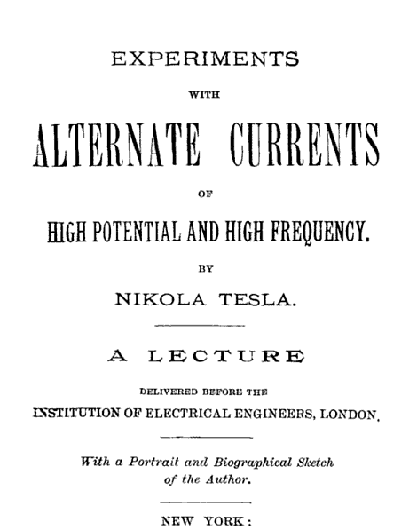

__Vorträge gehalten in London im Institute of Electrical Engineers am 3. Februar 1892 und im Royal Institute am 4. Februar 1892.__ 

„Es gibt keinen fesselnderen Gegenstand, welcher mehr des Studiums wert wäre als die Natur. Diesen großen Mechanismus zu verstehen, die Kräfte, welche wirksam sind, und die Gesetze, denen sie gehorchen, zu entdecken, ist das höchste Ziel der menschlichen Erkenntnis. 

Die Natur hat in dem Weltall eine unendliche Energie aufgespeichert. Der ewige Empfänger und Übertrager dieser unendlichen Energie ist der Äther. Die Erkenntnis der Existenz des Äthers und der Funktionen, welche er ausübt, ist eins der wichtigsten Ergebnisse moderner wissenschaftlicher Forschung. Das völlige Aufgeben der Vorstellung einer Wirkung in die Ferne, die Annahme eines den ganzen Raum durchdringenden und die gesamte Materie verbindenden Mittels hat die Geister der Denker von einem immerwährenden Zweifel befreit und durch Eröffnung eines neuen Gesichtskreises, neuer und unvorhergesehener Möglichkeiten den Erscheinungen, mit denen wir von alters her vertraut sind, ein erneutes Interesse gegeben. Es war ein großer Schritt vorwärts zum Verständnis der Naturkräfte und der mannigfachen Art, wie sie sich unsern Sinnen offenbaren. Es war für den erleuchteten Naturforscher das, was das Verständnis des Mechanismus der Feuerwaffe oder der Dampfmaschine für den Barbar ist. Erscheinungen, die wir als Wunder anzusehen gewohnt waren, welche einer Erklärung spotteten, sehen wir nun in ganz anderem Lichte. Der Funke einer Induktionsspule, das Glühen einer Glühlampe, die Äußerungen der mechanischen Kräfte von Strömen und Magneten liegen nicht mehr außerhalb unseres Fassungsvermögens. Anstatt auf etwas Unbegreifliches wie früher weist ihre Beobachtung nunmehr unsern Geist auf einen einfachen Mechanismus hin, und obwohl wir über dessen genaue Natur nur erst Vermutungen hegen können, so wissen wir doch, dass die Wahrheit nicht mehr lange verborgen bleiben kann, und fühlen instinktiv das Verständnis in uns aufdämmern. Wir bewundern noch immer diese schönen Phänomene, diese fremdartigen Kräfte, aber wir stehen ihnen nicht mehr hilflos gegenüber, wir können sie bis zu einem gewissen Grad erklären, sie der Rechnung unterziehen und sind voll Hoffnung, dass es schließlich gelingen werde, dass sie umgebende Dunkel ganz zu lichten. 

Inwieweit wir die Welt um uns her verstehen können, ist der letzte Gedanke eines jeden Erforschers der Natur. Die Rohheit unserer Sinne verhindert uns, die weitere Konstitution der Materie zu erkennen, und die Astronomie, diese erhabenste und positivste der Naturwissenschaften, kann uns nur etwas lehren, was gleichsam in unserer unmittelbaren Nachbarschaft vorgeht; von den entfernteren Teilen des grenzenlosen Universums mit seinen zahllosen Sternen und Sonnen wissen wir nichts. Aber weit hinaus über die Grenzen unserer Sinneswahrnehmung kann uns noch immer der Geist leiten und so dürfen wir hoffen, dass auch diese unbekannten Welten, unendlich kleine wie unendlich Größe, in gewissem Maß uns bekannt werden können. Doch selbst wenn diese Kenntnis erreicht werden sollte, wird der Forschungsgeist eine vielleicht für immer unübersteigliche Schranke für die wahre Erkenntnis dessen finden, was zu sein scheint, denn die bloße Erscheinungsform ist ja die einzige und schwache Grundlage für unsere ganze Philosophie. 

Von allen den Formen der unmessbaren, alles durchdringenden Energie der Natur, welche in fortwährender Änderung und Bewegung gleich einer Seele das träge Weltall belebt, sind Elektricität und Magnetismus vielleicht die anziehendsten. Die Wirkungen der Schwere, der Wärme und des Lichtes beobachten wir täglich; wir werden frühzeitig mit ihnen vertraut und frühzeitig verlieren sie für uns den Charakter des Merkwürdigen und Wunderbaren; aber die Elektricität und der Magnetismus mit ihrer eigenartigen Verwandtschaft, mit ihrem anscheinend dualistischen Charakter, der einzig dasteht unter den Kräften der Natur, mit ihren Erscheinungen der Anziehung, Abstoßung und Rotation, alles seltsame Äußerungen geheimnisvoller Kräfte, reizen den Geist mächtig zum Nachdenken und zu Untersuchungen an. Was ist Elektricität und was ist Magnetismus? Diese Fragen sind immer und immer wieder aufgeworfen worden. Die fähigsten Geister haben sich unaufhörlich mit dem Problem abgemüht und doch ist die Frage bis jetzt nicht vollständig beantwortet worden. Obwohl wir also auch heute noch nicht sagen können, was diese eigenartigen Kräfte sind, haben wir doch einen guten Schritt vorwärts getan zur Lösung des Problems. Wir sind jetzt überzeugt, dass elektrische und magnetische Erscheinungen dem Äther zuzuschreiben sind, und wir haben vielleicht nicht Unrecht, wenn wir sagen, dass die Wirkungen der statischen Elektricität Wirkungen des Äthers im Zustande der Spannung und diejenigen der dynamischen Elektricität und des Elektromagnetismus Wirkungen des Äthers im Zustande der Bewegung sind. Dies lässt aber immer noch die Frage unbeantwortet, was Elektricität und Magnetismus wirklich sind. 

Zuerst fragen wir natürlich: "Was ist Elektricität und gibt es ein Ding Elektrizität? Bei der Erklärung elektrischer Erscheinungen können wir von Elektrizität oder von einem elektrischen Verhalten, einem elektrischen Zustande oder einer elektrischen Wirkung sprechen. Wenn wir von elektrischen Wirkungen sprechen, müssen wir zwei Arten solcher Wirkungen unterscheiden, welche ihrem Charakter nach entgegengesetzt sind und einander aufheben, da die Beobachtung zeigt, dass zwei solche entgegengesetzten Wirkungen existieren. Dies ist unvermeidlich, denn in einem Medium von den Eigenschaften des Äthers ist es nicht möglich, einen Druck auszuüben oder eine Verschiebung oder Bewegung irgendwelcher Art zu erzeugen, ohne in dem umgebenden Medium eine äquivalente und entgegengesetzte Wirkung zu veranlassen. Wenn wir aber von der Elektrizität als von einem Dinge sprechen, müssen wir meines Erachtens die Vorstellung zweier Elektrizitäten aufgeben, da die Existenz zweier solcher Dinge höchst unwahrscheinlich ist. Denn wie können wir uns zwei Dinge vorstellen, welche ihrem Betrage nach gleichwertig, gleich in ihren Eigenschaften, aber von entgegengesetztem Charakter sind, beide an der Materie haften, beide anziehend und einander neutralisierend wirken? Eine solche Annahme, die allerdings durch viele Erscheinungen an die Hand gegeben wird und sehr bequem für deren Erklärung ist, hat wenig Empfehlenswertes an sich. Wenn es ein solches Ding Elektrizität wirklich gibt, so kann es nur ein solches Ding geben und es ist nur ein Überschuss oder ein Mangel an diesem einen Dinge möglich; wahrscheinlicher aber ist es, dass seine Beschaffenheit den positiven und negativen Charakter bestimmt. Die alte Theorie von Franklin ist, obwohl sie in mancher Beziehung nicht ausreicht, von einem gewissen Gesichtspunkt aus nach allem die plausibelste. Und doch ist trotzdem die Theorie der beiden Elektrizitäten allgemein angenommen, da sie anscheinend die elektrischen Erscheinungen in einer befriedigenderen Weise erklärt. Aber eine Theorie, welche die Tatsachen besser erklärt, ist nicht notwendiger Weise wahr. Geistreiche Köpfe werden Theorien erfinden, welche sich der Beobachtung anpassen, und fast jeder unabhängige Denker hat seine eigenen Ansichten über den Gegenstand. 

Nicht in der Absicht, einer Meinung Geltung zu verschaffen, sondern in dem Wunsche, Sie besser mit einigen der Resultate, welche ich beschreiben will, bekannt zu machen, will ich Ihnen den Gedankengang, dem ich gefolgt bin, und den Ausgangspunkt, den ich genommen habe, darlegen. Ich gestatte mir daher, die Ansichten und Überzeugungen, welche mich zu diesen Resultaten geführt haben, mit wenigen Worten auseinanderzusetzen. 

Ich neige der Vorstellung zu, dass es ein Ding gibt, welches wir gewohnt sind Elektrizität zu nennen. Die Frage ist: Was ist dieses Ding? oder welches von allen Dingen, von deren Existenz wir wissen, können wir mit bestem Grunde Elektrizität nennen? Wir wissen, dass es ähnlich wie eine inkompressible Flüssigkeit wirkt; dass davon eine konstant bleibende Menge in der Natur vorhanden sein muss; dass es weder erzeugt noch zerstört werden kann, und dass, was wichtiger ist, die elektromagnetische Theorie des Lichtes und alle beobachteten Tatsachen uns lehren, dass die Erscheinungen der Elektrizität und des Äthers identisch sind. Es drängt sich daher sofort der Gedanke von selbst auf, dass Elektrizität Äther genannt werden könnte. In der Tat ist diese Ansicht in gewissem Sinne von Dr. Lodge vertreten worden. Sein interessantes Werk wurde von Jedermann gelesen und viele ließen sich durch seine Argumente überzeugen. Seine große Geschicklichkeit und die interessante Natur des Gegenstandes nehmen den Leser zunächst gefangen; wenn aber die Eindrücke sich abgeschwächt haben, merkt man, dass man es nur mit geistreichen Erklärungen zu tun hat. Ich muss gestehen, dass ich nicht an zwei Elektrizitäten, noch weniger an einen Äther von zwiefacher Konstitution glauben kann. Das überraschende Verhalten des Äthers als eines festen Körpers gegenüber Licht- und Wärmewellen und als einer Flüssigkeit gegenüber den sich durch ihn hindurchbewegenden Körpern wird sicher in der natürlichsten und befriedigendsten Weise erklärt durch die Annahme, dass er sich selbst, in Bewegung befindet, wie schon von Sir "William Thomson angedeutet wurde; aber abgesehen hiervon gibt es nichts, was uns berechtigen würde, mit Sicherheit zu schließen, dass eine Flüssigkeit, die nicht im Stande wäre, transversale Schwingungen von einigen Hundert oder Tausend per Sekunde zu übertragen, auch nicht im Stande sein könne, solche Schwingungen fortzupflanzen, wenn sie nach Hunderten von Billionen in der Sekunde zählen. Auch kann Niemand beweisen, dass es transversale Ätherwellen gibt, die von einer eine geringe Anzahl von Wechseln per Sekunde gebenden Wechselstrommaschine ausgesandt werden; gegen solche langsamen Störungen kann sich der Äther, wenn er in Ruhe ist, wie eine wirkliche Flüssigkeit verhalten. 

Kehren wir zum Gegenstande zurück und erinnern wir uns, dass die Existenz zweier Elektrizitäten, gelinde ausgedrückt, höchst unwahrscheinlich ist, so müssen wir sagen, dass wir keinen Nachweis der Elektrizität besitzen, noch hoffen können ihn zu erlangen, wenn keine grobe Materie da ist. Elektrizität kann daher nicht Äther in dem weiten Sinne des Wortes genannt werden; es scheint aber nichts im Wege zu stehen, die Elektrizität Äther in Verbindung mit Materie oder gebundenen Äther zu nennen oder, mit anderen Worten, anzunehmen, dass die sogenannte statische Ladung des Moleküls Äther ist, der in gewisser Weise mit dem Molekül verbunden ist. Wenn wir die Sache in diesem Lichte betrachten, würden wir berechtigt sein zu sagen, dass Elektrizität bei allen molekularen Wirkungen im Spiel ist. 

Was nun aber eigentlich der die Moleküle umgebende Äther ist, und worin er sich vom Äther im Allgemeinen unterscheidet, kann nur vermutet werden. In der Dichtigkeit kann er sich nicht unterscheiden, da Äther nicht zusammendrückbar sind; er muss sich daher unter einem gewissen Drucke oder in Bewegung befinden und das letztere ist das wahrscheinlichste. Um seine Funktionen zu verstehen, würde man eine exakte Vorstellung von der physikalischen Konstitution der Materie haben müssen, von der wir uns natürlich nur ein Phantasiebild machen können. 

Von allen Naturanschauungen ist indessen diejenige, welche eine Materie und eine Kraft und durchweg vollkommene Gleichförmigkeit annimmt, die wissenschaftlichste und am wahrscheinlichsten richtig. Eine infinitesimale Welt mit ihren Molekülen und deren Atomen, die sich in ganz gleicher Art wie die Himmelskörper um sich selbst drehen und in Bahnen umeinander herumbewegen, Äther mit sich reißen und wahrscheinlich mit sich herumwirbeln oder, mit andern Worten, statische Ladungen mit sich führen, erscheint meinem Verstände als die wahrscheinlichste Vorstellung, welche auch in plausibler Weise die meisten der beobachteten Erscheinungen erklärt. Das Herumwirbeln der Moleküle und ihres Äthers erzeugt die Ätherspannungen oder elektrostatischen Drucke; die Ausgleichung der Ätherspannungen ruft Ätherbewegungen oder elektrische Ströme hervor und die Bewegungen in gewissen Bahnen umeinander erzeugen die Wirkungen des Elektromagnetismus und permanenten Magnetismus. 

Vor circa fünfzehn Jahren bewies Professor Rowland eine sehr interessante und wichtige Tatsache, nämlich dass eine im Kreis herumgeführte statische Ladung die Wirkungen eines elektrischen Stromes hervorbringt. Lässt man die eigentliche Natur des Mechanismus, welcher die Anziehung und Abstoßung der Ströme hervorbringt, außer Betracht und denkt man sich die elektrostatisch geladenen Moleküle in Bewegung, so gibt uns diese experimentelle Tatsache eine recht gute Vorstellung vom Magnetismus. Wir können uns Kraftlinien oder Kraftröhren denken, welche physikalisch existieren und aus Reihen von gleichgerichteten sich bewegenden Molekülen bestehen; wir können sehen, dass diese Linien geschlossen sein müssen, dass sie sich zu verkürzen und zu erweitern suchen müssen usw. Sie erklärt auch in vernünftiger Weise die seltsamste Erscheinung von allen, nämlich den permanenten Magnetismus, und besitzt überhaupt alle Schönheiten der Ampere'schen Theorie, ohne den Grundfehler derselben zu besitzen, der in der Annahme molekularer Ströme besteht. Ohne mich weiter auf diesen Gegenstand einzulassen, will ich nur bemerken, dass ich alle elektrostatischen Strom und magnetischen Erscheinungen als von elektrostatischen molekularen Kräften ausgehend betrachte. 

Die vorstehenden Bemerkungen hielt ich für ein völliges Verständnis der Vorstellungen, die ich mir von diesem Gegenstande mache, für notwendig. 

Von allen diesen Erscheinungen sind die Stromphänomene für das Studium die wichtigsten, in Anbetracht der bereits ausgedehnten und stets zunehmenden Verwendung der Ströme für industrielle Zwecke. Es sind jetzt hundert Jahre her, seit die erste praktische Stromquelle hergestellt wurde, und seitdem sind die das Fließen der Ströme begleitenden Erscheinungen fleißig studiert und dank den unermüdlichen Bemühungen der Gelehrten die einfachen Gesetze, denen sie gehorchen, entdeckt worden. Diese Gesetze gelten aber, wie sich herausgestellt hat, nur, wenn die Ströme einen sich gleichbleibenden Charakter haben. Wenn sich die Ströme sehr rasch in ihrer Stärke ändern, so treten ganz verschiedene, oft unerwartete Erscheinungen auf und es gelten ganz verschiedene Gesetze, welche bis jetzt noch nicht so vollständig, wie man wünschen möchte, untersucht worden sind, obschon durch die Arbeiten namentlich englischer Gelehrten hinreichend Licht über den Gegenstand verbreitet wurde, um uns in den Stand zu setzen, einfache Fälle, wie sie jetzt in der täglichen Praxis vorkommen, zu behandeln. 

Die Erscheinungen, welche Strömen von schnell wechselndem Charakter eigentümlich sind, treten weit deutlicher hervor, wenn die Geschwindigkeit der Änderung zunimmt, daher das Studium dieser Ströme durch die Anwendung passend konstruierter Apparate erheblich erleichtert wird. Aus diesen und aus andern Gründen konstruierte ich Wechselstrommaschinen, welche mehr als zwei Millionen Stromumkehrungen per Minute zu geben vermögen, und hauptsächlich diesem Umstände ist es zu danken, dass ich im Stande bin, Sie mit einigen der bisher erhaltenen Resultate bekannt zu machen, die, wie ich hoffe, in Anbetracht ihrer direkten Bedeutung für eins der wichtigsten Probleme, nämlich die Schaffung einer praktischen und wirksamen Lichtquelle, sich als ein Schritt vorwärts erweisen werden. 

Das Studium solcher schnell wechselnden Ströme ist sehr interessant. Fast jedes Experiment offenbart etwas Neues. Manche Resultate konnten vorausgesagt werden, viel mehr aber ließen sich nicht vorhersehen. Der Experimentator macht viele interessante Beobachtungen. Wir nehmen z. B. ein Stück Bisen und halten es gegen einen Magnet. Gehen wir von wenigen Wechseln aus und lassen die Zahl derselben höher und höher steigen, so fühlen wir, wie die Stromimpulse schneller und schneller einander folgen, dabei schwächer und schwächer werden und schließlich verschwinden. Wir beobachten dann einen kontinuierlichen Zug; der Zug ist natürlich nicht kontinuierlich, er erscheint uns nur so, weil unser Tastsinn unvollkommen ist. 
Ferner können wir zwischen den Elektroden einen Lichtbogen herstellen und beobachten, sobald die Wechsel schneller aufeinander folgen, dass der Ton, welcher Wechselstromlichtbogen eigen ist, schriller und schriller wird, dann allmählich schwächer wird und schließlich ganz aufhört. Die Luftschwingungen dauern fort, aber dieselben sind zu schwach, um wahrgenommen werden zu können; unser Gehörsinn lässt uns im Stich. 

Wir beobachten die geringen physiologischen Wirkungen, die schnelle Erwärmung von Eisenkernen und Leitern, seltsame Induktionserscheinungen, interessante Kondensatorerscheinungen und noch interessantere Lichterscheinungen mit einer Induktionsspule hoher Spannung. Alle diese Versuche und Beobachtungen würden von größtem Interesse für den Studierenden sein, aber ihre Beschreibung würde mich zu weit von dem Hauptgegenstande abführen. Teils aus diesem Grunde, teils wegen ihrer ungemein größeren Wichtigkeit werde ich mich auf die Beschreibung der durch diese Ströme hervorgebrachten Lichteffekte beschränken. 

Bei den zu diesem Zwecke vorgenommenen Versuchen wurde eine Induktionsspule von hoher Spannung oder ein gleichwertiger Apparat zur Umwandlung von Strömen von verhältnismäßig niedriger Spannung in solche von hoher Spannung benutzt. 

Wenn Sie an den Resultaten ein genügendes Interesse nehmen, will ich Ihnen auseinandersetzen, wie man das experimentelle Studium dieses Gegenstandes anfängt; wenn Sie die Richtigkeit der von mir vorgebrachten Argumente anerkennen, werden Sie selbst gern hohe Frequenzen und hohe Potentiale, mit anderen Worten, mächtige elektrostatische Wirkungen erzeugen wollen. Es werden Ihnen dann manche Schwierigkeiten entgegentreten, nach deren völliger Überwindung man wahrhaft wunderbare Resultate erlangen würde. 

Zuerst tritt einem die Schwierigkeit entgegen, die erforderlichen Frequenzen mittels mechanischer Apparate zu erreichen," und wenn dieselben in anderer Weise erreicht sind, stellen sich wieder Hindernisse anderer Art ein. Zunächst erweist es sich als schwierig, ohne beträchtliche Vergrößerung des Umfanges der Apparate die erforderliche Isolation herzustellen; denn die erforderlichen Spannungen sind hoch und die Isolation bietet infolge der Heftigkeit der Stromwechsel ganz besondere Schwierigkeiten. So kann z. B. bei Anwesenheit eines Gases die Entladung infolge des Anprallens der Gasmoleküle und der daraus sich ergebenden Erwärmung mehr als einen Zoll tief durch das beste Isolationsmaterial wie Glas, Hartgummi, Porzellan, Siegellack u. s. w. hindurchdringen, tatsächlich durch jede bekannte isolierende Substanz. Das Haupterfordernis bei der Isolation der Apparate ist daher die Ausschließung jeder gasartigen Masse. 

Im Allgemeinen weist meine Erfahrung darauf hin, dass Körper, welche die höchste spezifische Induktionskapazität besitzen, wie z. B. Glas, eine etwas geringere Isolation geben als andere, welche zwar gute Isolatoren sind, aber eine viel geringere spezifische Induktionskapazität haben, wie beispielsweise Öle, da die dielektrischen Verluste bei ersteren ohne Zweifel grösser sind. Die Schwierigkeit der Isolierung besteht nur, wenn die Spannungen außerordentlich hoch sind, denn bei Spannungen von etwa einigen Tausend Volt macht es keine besonderen Schwierigkeiten, Ströme von einer Maschine, die etwa 20000 Wechsel per Sekunde gibt, auf eine ziemliche Entfernung fortzuleiten. Diese Wechselzahl ist indessen für viele Zwecke viel zu klein, wenn auch für manche praktischen Anwendungen völlig ausreichend. Diese Schwierigkeit der Isolierung ist glücklicherweise kein wesentliches Hindernis; sie beeinflusst hauptsächlich die Größe der Apparate, da man, wenn außerordentlich hohe Spannungen angewendet werden sollen, die Beleuchtungskörper nicht weit von dem Apparate aufstellen würde, und oft würden sich dieselben ganz dicht bei diesem befinden. Da das Bombardement des isolierten Drahtes durch die Luftmoleküle von einer Kondensatorwirkung abhängt, so würde der Verlust auf eine Kleinigkeit reduziert werden können, wenn man äußerst dünne, aber stark isolierte Drähte verwendete. 

Noch eine andere Schwierigkeit bereitet die Kapazität und Selbstinduktion, welche die Spule notwendigerweise besitzt. Ist die Spule groß, d. h. enthält sie eine große Drahtlänge, so ist sie im Allgemeinen für äußerst hohe Frequenzen ungeeignet; ist sie klein, so ist sie allerdings für derartige Frequenzen gut geeignet, aber die Spannung könnte dann nicht so hoch, wie erforderlich ist, sein. Ein guter Isolator und hauptsächlich einer, der nur geringe spezifische Induktionskapazität besitzt, würde aus doppeltem Grunde vorteilhaft sein. Erstens setzt er uns in den Stand, eine sehr kleine Spule herzustellen, welche enormen Spannungsdifferenzen zu widerstehen vermag, und zweitens ist eine solche kleine Spule wegen ihrer geringeren Kapazität und Selbstinduktion schnellerer und kräftigerer Schwingungen fähig. Ich betrachte daher das Problem, eine Spule oder einen Induktionsapparat irgendwelcher Art, welcher die gewünschte Eigenschaft besitzt, zu konstruieren, als ein nicht unwichtiges, und ich habe mich beträchtliche Zeit hindurch mit ihm beschäftigt. 

Der Forscher, welcher die von mir zu beschreibenden Versuche mit einer Wechselstrommaschine, die Ströme von der gewünschten Frequenz zu liefern vermag, und mit einer Induktionsspule wiederholen will, wird guttun, die primäre Spule ausschaltbar anzuordnen und die sekundäre Spule so zu montieren, dass er durch den Zylinder, auf welchen die sekundäre Spule gewickelt ist, hindurchsehen kann. Er wird dann die Strömungen beobachten können, welche von der primären Spule zu dem isolierenden Zylinder übergehen, und aus ihrer Intensität erkennen, wie weit er die Spule anstrengen kann. Ohne diese Vorsicht kann er sicher sein, dass er die Isolation beschädigt. Diese Anordnung gestattet überdies eine leichte Auswechselung der Primärspulen, die bei diesen Versuchen wünschenswert ist. 

Die Auswahl der Maschinentype, welche für den Zweck am geeignetsten ist, muss dem Ermessen des Experimentators überlassen bleiben. Es sind hier drei verschiedene Maschinentypen abgebildet, die ich neben andern bei meinen Versuchen benutzt habe. 


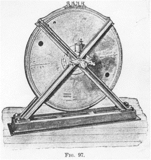
 
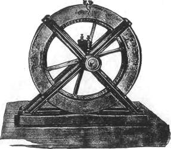


Fig. 97 stellt die bei meinen Versuchen vor diesem Institut benutzte Maschine dar. Der Feldmagnet besteht aus einem schmiedeeisernen Ring mit 384 Polvorsprüngen. Der Anker besteht aus einer Stahlscheibe, an welcher ein dünner, sorgfältig zusammen geschweißter Kranz aus Schmiedeeisen befestigt ist. Auf den Kranz sind mehrere Lagen eines feinen, gut ausgeglühten Eisendrahtes aufgewunden, welcher während des Aufwindens durch ein Schellackbad hindurchläuft. Die mit Seide umsponnenen Ankerdrähte sind um Messingstifte gewickelt. Der Durchmesser des Ankerdrahtes bei dieser Maschinentype sollte nicht mehr als 1/6 der Dicke der Polvorsprünge betragen, da sonst die lokale Wirkung erheblich ist. 

Fig. 98 stellt eine größere Maschine einer anderen Type dar. Der Feldmagnet dieser Maschine besteht aus zwei gleichen Teilen, deren jeder eine Erregungsspule enthält oder die unabhängig gewickelt sind. Jeder Teil hat 480 Polansätze, und zwar stehen die Polansätze des einen Teils denen des andern gegenüber. Der Anker besteht aus einem Rad aus harter Bronze, welches die Leiter trägt, die zwischen den Vorsprüngen des Feldmagneten rotieren. Um die Ankerleiter zu wickeln, verfährt man nach meiner Erfahrung am zweckmäßigsten in der folgenden Weise. Man stellt einen Ring aus harter Bronze von der gewünschten Größe her. Dieser Ring und der Kranz des Rades werden mit der passenden Anzahl von Stiften versehen und beide auf einer Platte befestigt. Nachdem die Ankerleiter gewickelt sind, werden die Stifte abgeschnitten und die Enden der Leiter an zwei Ringen befestigt, welche an dem Bronzering bzw. an dem Radkranze festgeschraubt werden. Das Ganze kann dann abgenommen werden und bildet ein festes Gefüge. Die Leiter bei einer solchen Maschinentype sollen aus Kupferblech bestehen, dessen Dicke natürlich von der Dicke der Polansätze abhängt, oder sonst sind geflochtene dünne Drähte anzuwenden. 

 


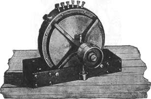


Fig. 99 ist eine kleinere Maschine, welche in vielen Beziehungen der ersten ähnlich ist, nur sind hier die Ankerleiter und die Erregungsspule stationär, während nur ein schmiedeeiserner Block rotiert wird. 

Es würde zwecklos sein, diese Beschreibung weiter auszudehnen und die Konstruktionsdetails dieser Maschinen hier ausführlicher anzugeben. Dieselben sind überdies in „The Electrical Engineer" vom 18. März 1891 näher beschrieben worden. Ich erachte es aber für zweckmäßig, die Aufmerksamkeit des Forschers auf zwei Dinge zu lenken, deren "Wichtigkeit er, trotzdem dieselbe von selbst einleuchtet, doch leicht unterschätzt; ich meine die lokale Wirkung in den Leitern, welche sorgfältig vermieden werden muss, und den Luftraum, der nur gering sein darf. Ich will hinzufügen, dass, da es wünschenswert ist, sehr hohe Umfangsgeschwindigkeiten zu verwenden, der Durchmesser des Ankers sehr groß sein sollte, um unpraktische Riemengeschwindigkeiten zu vermeiden. Von den verschiedenen Typen dieser Maschinen, welche von mir konstruiert wurden, hat mir die in Fig. 97 dargestellte Maschine die wenigsten Schwierigkeiten bereitet sowohl bei der Konstruktion wie bei der Instandhaltung, und im Ganzen genommen ist sie eine gute Versuchsmaschine gewesen. 

Beim Betrieb einer Induktionsspule mit sehr rasch wechselnden Strömen erregen unter den Lichterscheinungen, die man zunächst beobachtet, natürlich diejenigen besonderes Interesse, welche durch die Hochspannungsentladung veranlasst werden. In dem Maaß wie die Zahl der Wechsel per Sekunde zunimmt oder — bei hohen Wechselzahlen — der durch die Primärspule gehende Strom variiert wird, ändert die Entladung allmählich ihr Aussehen. Es würde schwer sein, die geringeren Änderungen, welche auftreten, und die Bedingungen, unter denen sie zu Stande kommen, zu beschreiben; man kann jedoch fünf deutlich verschiedene Formen der Entladung wahrnehmen. 

Zunächst kann man eine schwache empfindliche Entladung in der Form eines dünnen, schwach gefärbten Fadens beobachten (Fig. 100a). Dieselbe tritt immer auf, wenn die Zahl der Wechsel per Sekunde hoch und der Strom durch die Primärspule sehr schwach ist. Trotz des außerordentlich schwachen Stromes ist das Änderungsverhältnis des Stromes groß und die Spannungsdifferenz an den Klemmen der Sekundärspule daher beträchtlich, so dass der Lichtbogen auf große Entfernungen hin zu Stande kommt; die in Bewegung gesetzte Elektrizitätsmenge ist jedoch unbedeutend und kaum ausreichend, um einen dünnen fadenförmigen Bogen zu bilden. Derselbe ist außerordentlich empfindlich und diese Empfindlichkeit kann so sehr gesteigert werden, dass das bloße Atmen in der Nähe der Spule ihn beeinflusst und derselbe beständig umherflackert, wenn er nicht vollständig gegen Luftströmungen geschützt ist. Dessen ungeachtet ist er in dieser Form äußerst andauernd, und wenn die Pole einander auf etwa ein Drittel der Funkenweite genähert werden, so lässt er sich nur schwer ausblasen. Diese ausnahmsweise Dauerhaftigkeit bei geringer Länge rührt hauptsächlich davon her, dass der Bogen äußerst dünn ist und daher dem Luftzuge eine sehr geringe Fläche darbietet. Die große Empfindlichkeit des Lichtbogens bei sehr großer Länge ist wahrscheinlich der Bewegung der in der Luft schwebenden Staubteilchen zuzuschreiben. 


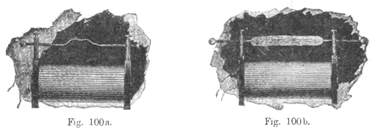


Wenn der durch die primäre Spule fließende Strom verstärkt wird, so nimmt die Entladung an Breite und Stärke zu und die Wirkung der Kapazität der Spule wird sichtbar, bis schließlich unter geeigneten Bedingungen ein weißer, oft fingerdicker und über die ganze Spule hinweg schlagender Flammenbogen erzeugt wird (Fig. 100b). Derselbe entwickelt eine deutlich wahrnehmbare Wärme und ist noch durch das Fehlen des hohen Tones, welcher die weniger kräftigen Entladungen begleitet, charakterisiert. Es würde nicht ratsam sein, sich einem Schlage der Spule unter diesen Verhältnissen auszusetzen, obwohl man unter anderen Bedingungen, wo die Spannung viel höher ist, einen Schlag von der Spule ungestraft erhalten kann. Um diese Art von Entladung hervorzubringen, darf die Anzahl der Stromwechsel per Sekunde für die benutzte Spule nicht zu groß sein und es müssen, allgemein gesprochen, gewisse Beziehungen zwischen Kapazität, Selbstinduktion und Frequenz innegehalten werden. 

Die Wichtigkeit dieser Elemente bei einem Wechselstromkreis ist zurzeit wohlbekannt und unter gewöhnlichen Verhältnissen sind die allgemeinen Regeln anwendbar. Bei einer Induktionsspule herrschen aber ausnahmsweise Zustände. Zunächst ist die Selbstinduktion von geringer Bedeutung, bevor sich der Bogen gebildet hat, dann aber macht sie sich bemerklich, jedoch wohl niemals in so hervorragendem Maaß wie in gewöhnlichen Wechselstromkreisen, weil die Kapazität über die ganze Spule verteilt ist und die Spule sich gewöhnlich durch sehr große Widerstände entladet, so dass die Ströme außerordentlich gering sind. Ferner nimmt die Kapazität mit wachsender Spannung beständig zu, infolge der Absorption, welche in beträchtlichem Umfange stattfindet. Infolgedessen besteht zwischen diesen Größen keine kritische Beziehung und die gewöhnlichen Regeln dürften kaum anwendbar sein. In dem Maaß wie die Spannung wächst entweder infolge der vermehrten Frequenz oder des verstärkten Stromes durch die Primärspule, wird der Betrag der aufgespeicherten Energie grösser und grösser und die Kapazität gewinnt mehr und mehr an Wichtigkeit. Bis zu einem gewissen Punkte ist die Kapazität vorteilhaft, darüber hinaus aber beginnt sie ein mächtiges Hindernis zu werden. Es ergibt sich hieraus, dass jede Spule bei einer gewissen Frequenz und einem gewissen primären Strom die besten Resultate gibt. Eine sehr große Spule kann, wenn mit Strömen von sehr hoher Frequenz betrieben, Funken von höchstens 3 — 4 mm geben. Fügt man an den Polen Kapazität hinzu, so lässt sich die Sachlage verbessern, was aber der Spule in Wirklichkeit fehlt, ist eine niedrigere Frequenz. 

Wenn die flammende Entladung eintritt, sind die Verhältnisse offenbar derart, dass der stärkste Strom durch den Stromkreis gesandt wird. Diese Verhältnisse können durch Veränderung der Frequenz innerhalb weiter Grenzen herbeigeführt werden, die höchste Frequenz aber, bei welcher der Flammenbogen noch hervorgebracht werden kann, bestimmt bei gegebenem Primärstrom die maximale Schlagweite der Spule. Bei der flammenden Entladung ist die auffällige Wirkung der Kapazität nicht wahrnehmbar; die Geschwindigkeit, mit welcher die Energie aufgespeichert wird, ist dann gerade gleich der Geschwindigkeit, mit welcher dieselbe in dem ganzen Stromkreis verwendet werden kann. Diese Art der Entladung ist die strengste Probe für eine Spule; das Durchschlagen, wenn ein solches eintritt, ist von ganz ähnlicher Beschaffenheit wie bei einer überladenen Leydener Flasche. Um nur eine annähernde Angabe zu machen, will ich anführen, dass bei einer gewöhnlichen Spule von etwa 10000 Ohm Widerstand der mächtigste Lichtbogen bei ca. 12000 Wechseln per Sekunde hervorgebracht werden würde. 

Wenn die Frequenz über diese Zahl hinaus vermehrt wird, steigt natürlich die Spannung, trotzdem aber kann, so paradox dies scheinen mag, die Schlagweite abnehmen. In dem Maaß wie die Spannung höher wird, nimmt die Spule mehr und mehr die Eigenschaften einer statischen Maschine an, bis man schließlich die schöne Erscheinung der Büschelentladung (Fig. 101) beobachtet, die sich über die ganze Länge der Spule erstrecken kann. In diesem Stadium beginnen von allen Spitzen und Vorsprüngen Lichtströme frei herauszutreten. Diese Lichtbüschel sieht man auch in dem Raum zwischen der primären Spule und der isolierenden Röhre in Fülle übertreten. Ist die Spannung außerordentlich hoch, so treten dieselben immer auf, auch wenn die Frequenz gering ist, und selbst dann, wenn die Primärspule mit einer zolldicken Schicht von Wachs, Hartgummi, Glas oder einer andern isolierenden Substanz umgeben ist. Dies beschränkt die Leistungsfähigkeit der Spule erheblich, ich werde aber später zeigen, wie ich im Stande gewesen bin, diesen Übelstand bei der gewöhnlichen Spule in beträchtlichem Maaß zu überwinden. 

Außer von der Spannung hängt die Intensität der Lichtbüschel von der Frequenz ab; wenn aber die Spule sehr groß ist, so zeigen sie sich, wie gering auch die benutzten Frequenzen sein mögen. Z. B. traten dieselben bei einer sehr großen, von mir vor einiger Zeit verfertigten Spule von 67000 Ohm Widerstand schon bei 100 Wechseln per Sekunde und weniger auf, wobei die Isolation der Sekundärspule aus 19 mm starkem Ebonit bestand. Sind die Ströme sehr intensiv, so erzeugen sie ein Geräusch, welches dem beim Laden einer Holtz'schen Maschine entstehenden ähnlich, aber viel stärker als dieses ist, und sie entwickeln einen starken Ozongeruch. Je geringer die Frequenz ist, eher sind sie im Stande, die Spule plötzlich zu beschädigen. Bei außerordentlich, hohen Frequenzen können sie frei übertreten, ohne irgendeine andere "Wirkung hervorzubringen, als dass sie die Isolation langsam und gleichmäßig erwärmen. 

Das Vorhandensein solcher Büschelentladungen zeigt, wie wichtig es ist, eine teure Spule so herzustellen, dass man durch die die Primärspule umgebende Röhre hindurchsehen kann, auch sollte die Primärspule leicht auswechselbar sein; oder sonst sollte der Raum zwischen der primären und sekundären Spule mit Isoliermaterial so vollständig ausgefüllt sein, dass alle Luft ausgeschlossen ist. Die Nichtbeobachtung dieser einfachen Regel bei der Herstellung der im Handel befindlichen Spulen trägt die Schuld an der Zerstörung mancher kostbaren Spule. 


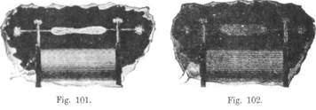


In dem Stadium, wo die Büschelentladung eintritt, oder bei etwas höheren Frequenzen, kann man, indem man die Pole einander nähert und die Wirkung der Kapazität zweckmäßig reguliert, einen wahren Sprühregen von kleinen silberweißen Funken oder ein Bündel von äußerst dünnen silberfarbigen Fäden mitten in einem kräftigen Büschel (Fig. 102) hervorbringen, wobei jeder Funke oder Faden möglicher Weise einem Stromwechsel entspricht. Unter geeigneten Umständen hervorgebracht, ist dies wahrscheinlich die schönste Entladung, und bietet, wenn ein Luftstrom gegen sie gerichtet wird, ein eigenartiges Aussehen dar. Der Funkenregen verursacht, wenn man ihn durch den Körper gehen lässt, einiges Unbehagen, während bei der einfach strömenden Entladung nichts Derartiges gefühlt wird, falls man in den Händen große Leiterstücke hält, um dieselben vor kleinen Brandwunden zu schützen. 

Wird die Frequenz noch weiter vermehrt, so gibt die Spule keinen Funken mehr außer bei kleinen Entfernungen, und man kann die fünfte typische Form der Entladung beobachten (Fig. 103). Die Tendenz des Ausströmens und sich Zerstreuens ist dann so stark, dass, wenn das Büschel an der einen Elektrode erzeugt wird, kein Funke entsteht, selbst wenn, wie ich wiederholt versucht habe, die Hand oder irgendein anderer leitender Gegenstand in die Strömung hineingehalten wird; und was noch seltsamer ist, der Lichtstrom wird durch die Annäherung eines leitenden Körpers überhaupt nicht leicht abgelenkt. 

In diesem Stadium gehen die Ströme scheinbar mit der größten Bequemlichkeit durch Isolatoren von erheblicher Dicke hindurch und es ist besonders interessant, ihr Verhalten zu studieren. Zu diesem Zwecke empfiehlt es sich, mit den Enden der Spule zwei metallische Kugeln zu verbinden, die man in jede beliebige Entfernung zueinander bringen kann (Fig. 104). 


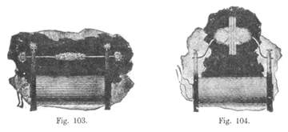


Kugeln verdienen den Vorzug vor Platten, da die Entladung besser beobachtet werden kann. Durch Einschiebung dielektrischer Körper zwischen die Kugeln lassen sich prachtvolle Entladungserscheinungen beobachten. Sind die Kugeln dicht aneinander und spielt ein Funke zwischen ihnen, so hört der Funke nach Zwischenlegung einer dünnen Ebonit-Platte zwischen die Kugeln augenblicklich auf, und die Entladung breitet sich zu einem intensiv leuchtenden Kreise von mehreren Zoll Durchmesser aus, vorausgesetzt, dass die Kugeln hinreichend groß sind. Der Durchgang der Ströme erwärmt und erweicht nach einer Weile den Ebonit so sehr, dass in dieser Weise zwei Platten zusammengeschweißt werden können. Sind die Kugeln so weit auseinander, dass kein Funken entsteht, so wird die Entladung, selbst wenn die Kugeln weit über die Schlagweite hinaus voneinander entfernt sind, durch Einschiebung einer dicken Glasplatte sofort veranlasst, von den Kugeln zu dem Glas in Form leuchtender Ströme überzugehen. Es hat fast den Anschein, als ob diese Ströme durch das Dielektrikum hindurch gingen. In Wirklichkeit ist dies nicht der Fall, da die Strömungen von den Luftmolekülen herrühren, welche in dem Raume zwischen den entgegengesetzt geladenen Flächen der Kugeln in heftige Bewegung versetzt werden. Ist kein anderes Dielektrikum weiter als Luft vorhanden, so findet das Bombardement ebenfalls statt, aber dasselbe ist zu schwach, um sichtbar zu sein. Durch Einschiebung eines Dielektrikums wird die induktive Wirkung verstärkt und überdies finden die fortgeschleuderten Luftmoleküle ein Hindernis und das Bombardement wird so intensiv, dass die Ströme leuchtend werden. Könnten wir durch irgendein mechanisches Mittel eine solche heftige Bewegung der Moleküle hervorbringen, so würden wir dieselbe Erscheinung hervorrufen können. Ein Luftstrom, welcher aus einer kleinen Öffnung unter enormem Druck herausströmt und gegen eine isolierende Substanz wie z. B. Glas trifft, kann im Dunkeln leuchtend werden, und es würde möglich sein, auf diese Weise eine Phosphoreszenz des Glases oder anderer Isolatoren hervorzubringen. 

Je grösser die spezifische Induktionskapazität des zwischengeschalteten Dielektrikums ist, umso mächtiger ist die erzeugte Wirkung. Infolgedessen treten die Strömungen bei äußerst hohen Spannungen, selbst wenn das Glas 40 — 50 mm dick ist, auf. Aber außer der von dem Bombardement herrührenden Erwärmung entsteht unzweifelhaft in dem Dielektrikum etwas Wärme, die anscheinend im Glas grösser ist als im Ebonit. Ich schreibe dies der größeren spezifischen Induktionskapazität des Glases zu, infolge deren bei derselben Spannungsdifferenz ein größerer Energiebetrag aufgenommen wird als im Ebonit. Die Sache verhält sich ähnlich, wie wenn man mit einer Batterie einen Kupfer- und einen Messingdraht von gleichen Dimensionen verbindet. Der Kupferdraht, der doch ein vollkommenerer Leiter ist, erwärmt sich deshalb mehr, weil er mehr Strom aufnimmt. Es ist also das, was man sonst als einen Vorzug des Glases betrachtet, hier ein Mangel. Glas gibt gewöhnlich viel schneller nach als Ebonit; wird dasselbe bis zu einem gewissen Grade erwärmt, so schlägt die Entladung plötzlich an einer Stelle durch und nimmt dann die gewöhnliche Form eines Bogens an. 

Die durch das molekulare Bombardement des Dielektrikums erzeugte Wärmewirkung nimmt ab, sobald der Luftdruck zunimmt, und bei enormem Luftdrucke würde sie vernachlässigt werden können, wofern nicht die Frequenz entsprechend zunähme. 

Es wird bei diesen Versuchen oft beobachtet, dass, wenn die Kugeln sich jenseits der Schlagweite befinden, durch die Annäherung z. B. einer Glasplatte bewirkt werden kann, dass der Funke zwischen den Kugeln überspringt. Dies tritt ein, wenn die Kapazität der Kugeln sich, etwas unterhalb des kritischen Wertes befindet, welcher die größte Spannungsdifferenz an den Polen der Spule liefert. Durch Annäherung eines Dielektrikums wird die spezifische Induktionskapazität des Raumes zwischen den Kugeln vergrößert, was dieselbe Wirkung hervorbringt, als wenn die Kapazität der Kugeln vergrößert würde. Die Spannung an den Polen kann dann so hochsteigen, dass der Luftraum durchbrochen wird. Der Versuch wird am besten mit dichtem Glas oder mit Glimmer ausgeführt. 

Eine andere interessante Beobachtung ist die, dass eine Platte aus isolierendem Material, sobald die Entladung durch sie hindurchgeht, von einer der beiden Kugeln, und zwar von der näher liegenden, stark angezogen wird, was augenscheinlich von dem geringeren mechanischen Effekt des Bombardements auf dieser Seite und vielleicht auch von der größeren Elektrisierung herrührt. 

Aus dem Verhalten der Dielektrika bei diesen Versuchen können wir schließen, dass der beste Isolator für diese rasch wechselnden Ströme derjenige sein würde, welcher die geringste spezifische Induktionskapazität besitzt und gleichzeitig im Stande ist, den größten Spannungsdifferenzen zu widerstehen. Es ergeben sich daher zwei diametral entgegengesetzte Wege, um die gewünschte Isolation zu erhalten, nämlich entweder die Verwendung eines vollkommenen Vakuums oder eines Gases unter hohem Druck; das erstere ist indessen vorzuziehen. Leider aber ist keines dieser beiden Mittel in der Praxis leicht anwendbar. 


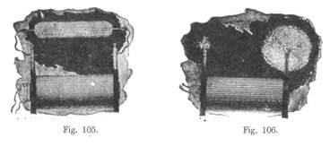


Es ist besonders interessant, das Verhalten eines äußerst hohen Vakuums bei diesen Versuchen zu beobachten. Wenn eine Versuchsröhre, welche mit äußeren Elektroden versehen und bis zum höchstmöglichen Grade luftleer gemacht ist, mit den Enden der Spule (Fig. 105) verbunden wird, so nehmen die Elektroden der Röhre augenblicklich eine hohe Temperatur an, und das Glas an jedem Ende der Röhre wird intensiv phosphoreszierend, die Mitte aber erscheint verhältnismäßig dunkel und bleibt eine Zeit lang kalt. 

Ist die Frequenz so hoch, dass die in Fig. 103 dargestellte Entladung beobachtet wird, so findet zweifellos in der Spule eine erhebliche Energiezerstreuung statt. Trotzdem kann die Spule eine lange Zeit in Tätigkeit sein, da die Erwärmung eine sehr allmähliche ist.

Trotz des Umstandes, dass die Spannungsdifferenz enorm sein kann, fühlt man doch nur wenig, wenn die Entladung durch den Körper geht, vorausgesetzt dass die Hände armiert sind. Dies hat bis zu gewissem Grade in der höheren Frequenz seinen Grund, hauptsächlich aber in dem Umstand, dass äußerlich weniger Energie verfügbar ist, wenn die Spannungsdifferenz einen enormen Wert erreicht; dies rührt davon her, dass bei steigender Spannung die in der Spule absorbierte Energie wie das Quadrat der Spannung zunimmt. Bis zu einem gewissen Punkte nimmt die Außen verfügbare Energie mit steigender Spannung zu, darauf beginnt sie schnell abzufallen. Es bestellt daher bei den gewöhnlichen Induktionsspulen hoher Spannung das seltsame Paradoxon, dass, während bei einem gegebenen durch die Primärspule fließenden Strome der Schlag tödlich sein würde, derselbe bei einem vielmal so starken Strome vollkommen harmlos sein könnte, selbst wenn die Frequenz dieselbe bliebe. Bei hohen Frequenzen und außerordentlich hohen Spannungen wird, wenn die Polen nicht mit Körpern von einigem Umfange verbunden sind, praktisch die gesamte in die Primärspule gelieferte Energie von der Spule aufgenommen. Es findet kein Durchschlagen, keine lokale Beschädigung statt, aber das gesamte isolierende wie leitende Material wird gleichmäßig erwärmt. 

Um Missverständnisse bezüglich der physiologischen Wirkung der Wechselströme von sehr hoher Frequenz zu vermeiden, halte ich es für notwendig anzuführen, dass man, trotzdem es eine unleugbare Tatsache ist, dass sie unvergleichlich weniger gefährlich sind als Ströme von niedrigeren Frequenzen, doch nicht glauben darf, sie seien ganz und gar harmlos. Was eben gesagt wurde, bezieht sich nur auf Ströme von einer gewöhnlichen Induktionsspule hoher Spannung, Ströme, die notwendig sehr klein sind; wenn dieselben direkt von einer Maschine oder von einer Sekundärspule von geringem Widerstände kommen, so bringen sie mehr oder weniger kräftige Wirkungen hervor und können ernste Beschädigungen zur Folge haben, besonders wenn sie in Verbindung mit Kondensatoren benutzt werden. 

Die Büschelentladung einer Induktionsspule hoher Spannung unterscheidet sich in vielen Beziehungen von derjenigen einer kräftigen statischen Maschine. In Bezug auf die Farbe besitzt sie weder das "Violett der positiven noch den weißen Glanz der negativen statischen Entladung, sondern liegt irgendwo zwischen beiden, und zwar natürlich abwechselnd mehr nach, der positiven oder mehr nach der negativen Seite. Da aber die Strömung mächtiger ist, wenn die Spitze oder Klemme positiv elektrisch, als wenn sie negativ elektrisch ist, so folgt, dass die Spitze des Büschels mehr der positiven und das Stammende mehr der negativen statischen Entladung gleicht. Im Dunkeln erscheint, falls das Büschel sehr stark entwickelt ist, das Stammende fast weiß. Der durch die entweichenden Ströme verursachte "Wind kann zwar mitunter sehr stark sein, so stark in der Tat, dass er in ziemlicher Entfernung von der Spule verspürt werden kann, trotzdem ist er aber in Anbetracht der Menge der Entladung geringer als der durch die positive Elektrode einer statischen Maschine erzeugte, und beeinflusst die Flamme viel weniger stark. Aus der Natur der Erscheinung können wir folgern, dass natürlich der von den Strömen hervorgebrachte "Wind umso schwächer ist, je höher die Frequenz ist, und bei genügend hohen Frequenzen würde bei dem gewöhnlichen atmosphärischen Drucke überhaupt kein Wind erzeugt werden. Bei Frequenzen, wie sie mittels einer Maschine erhalten werden können, ist der mechanische Effekt groß genug, um große Nadelräder mit beträchtlicher Geschwindigkeit zu drehen, was im Dunkeln infolge der zahlreichen Ausströmungen einen prächtigen Anblick gewährt (Fig. 106). 


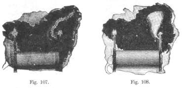


Im Allgemeinen können die meisten der Versuche, die man gewöhnlich mit einer statischen Maschine ausführt, auch mit einer Induktionsspule angestellt werden, wenn letztere mit sehr rasch wechselnden Strömen betrieben wird. Die erzeugten Effekte aber sind, weil von unvergleichlich größerer Stärke, viel überraschender. "Wenn ein kurzes Stück gewöhnlichen mit Baumwolle umsponnenen Drahtes (Fig. 107) an der einen Klemme der Spule befestigt wird, so können die von allen Punkten des Drahtes ausgehenden Strömungen so intensiv sein, dass sie eine erhebliche Lichtwirkung hervorbringen. Sind die Spannungen und Frequenzen sehr hoch, so scheint ein mit Guttapercha oder Kautschuk isolierter Draht, der an einer der Klemmen befestigt ist, mit einer leuchtenden Schicht bedeckt zu sein. Ein sehr dünner nackter Draht, der an einer Klemme befestigt ist, sendet mächtige Strömungen aus und vibriert beständig hin und her oder schwingt im Kreise umher, wodurch ein eigenartiger Effekt erzeugt wird (Fig. 108). Einige dieser Versuche sind von mir in „The Electrical World" vom 21. Februar 1891 beschrieben worden. 

Eine andere Eigentümlichkeit der rasch wechselnden Entladung einer Induktionsspule ist ihr völlig abweichendes Verhalten in Bezug auf Spitzen und abgerundete Flächen. 

Wenn ein dicker Draht, der am einen Ende mit einer Kugel und am andern Ende mit einer Spitze versehen ist, an dem positiven Pole einer statischen Maschine befestigt wird, so geht praktisch die ganze Ladung durch die Spitze verloren wegen der ungeheuer viel größeren Spannung, die vom Krümmungsradius abhängig ist. "Wird aber ein solcher Draht an einer der Klemmen der Induktionsspule angebracht, so beobachtet man, dass bei sehr hohen Frequenzen von der Kugel fast ebenso reichlich Strömungen ausgehen, wie von der Spitze (Fig. 109). 


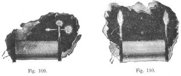


Es ist kaum denkbar, dass man bei einer statischen Maschine einen solchen Zustand in gleichem Grade hervorbringen könnte, aus dem einfachen Grunde, weil die Spannung zunimmt wie das Quadrat der Dichtigkeit, welche ihrerseits dem Krümmungsradius proportional ist; es würde daher bei einem konstanten Potential eine enorme Ladung erforderlich sein, um von einer polierten Kugel, während sie mit einer Spitze verbunden ist, Strömungen austreten zu lassen. Bei einer Induktionsspule aber, deren Ladung mit großer Schnelligkeit wechselt, ist die Sache anders. Hier haben wir es mit zwei verschiedenen Tendenzen zu tun. Erstens besteht diejenige Tendenz zu entweichen, welche bei einem Ruhezustande vorhanden ist und die vom Krümmungsradius abhängt; zweitens besteht die Tendenz, sich in die umgebende Luft zu zerstreuen infolge einer Kondensatorwirkung, welche von der Oberfläche abhängt. Wenn eine dieser Tendenzen ein Maximum ist, ist die andere ein Minimum. Bei der Spitze rührt die Lichtströmung hauptsächlich von den Luftmolekülen her, die mit der Spitze in wirkliche Berührung kommen; dieselben werden angezogen und abgestoßen, geladen und entladen, und nachdem ihre atomischen Ladungen auf solche Weise gestört sind, schwingen sie und senden Lichtwellen aus. Bei der Kugel dagegen wird zweifellos die Wirkung zum großen Teile durch Induktion hervorgebracht, da die Luftmoleküle nicht notwendig mit der Kugel in Berührung kommen, obwohl dies zweifellos auch geschieht. Um uns hiervon zu überzeugen, brauchen wir nur die Kondensatorwirkung zu erhöhen, z. B. dadurch, dass wir die Kugel in einiger Entfernung mit einem besseren Leiter, als das umgebende Medium ist, umhüllen, wobei natürlich der Leiter zu isolieren ist, oder dadurch, dass wir sie mit einem besseren Dielektrikum umgeben und ihr einen isolierten Leiter nähern; in beiden Fällen werden die Ströme reichlicher hervorbrechen. Je grösser ferner die Kugel bei gegebener Frequenz ist, oder je höher die Frequenz ist, umso mehr ist die Kugel im Vorteil gegenüber der Spitze. Da jedoch eine gewisse Intensität der "Wirkung erforderlich ist, um die Strömungen sichtbar zu machen, so ist klar, dass die Kugel bei dem beschriebenen Versuch nicht zu groß genommen werden sollte. Infolge dieser zweifachen Tendenz ist es möglich, mit Hilfe von Spitzen Wirkungen zu erzeugen, welche mit den durch Kapazität hervorgebrachten identisch sind. So kann man z. B. dadurch, dass man an einem Pole der Spule ein kurzes Stück berußten Drahtes, welcher viele Spitzen und die Möglichkeit leichten Entweichens darbietet, befestigt, die Spannung der Spule zu demselben Werte erhöhen, wie dadurch, dass man an dem Pole eine polierte Kugel von vielmal größerer Oberfläche als die des Drahtes anbringt. 

Ein interessanter Versuch, der die Wirkung der Spitzen dartut, kann in folgender Weise ausgeführt werden. Man befestige an dem einen Pole der Spule einen mit Baumwolle umsponnenen Draht von etwa 60 cm Länge und stelle denjenigen Zustand her, dass Lichtströme von dem Drahte ausgehen. Bei diesem Versuch ist die Primärspule zweckmäßig so anzubringen, dass sie nur etwa zur Hälfte in die Sekundärspule hineinragt. Nun berühre man den freien Pol der Sekundärspule mit einem in der Hand gehaltenen leitenden Gegenstande oder verbinde ihn auch mit einem isolierten Körper von gewissem Umfange. Auf diese Weise kann das Potential am Drahte enorm erhöht werden. Die Wirkung hiervon ist entweder eine Vermehrung oder Verminderung der Strömungen. Nehmen letztere zu, so ist der Draht zu kurz, nehmen sie ab, so ist er zu lang. Durch Regulierung der Länge des Drahtes findet man einen Punkt, wo die Berührung des andern Poles überhaupt keine Wirkung mehr auf die Büschel ausübt. In diesem Falle wird die Erhöhung der Spannung durch den Abfall derselben durch die Spule hindurch genau ausgeglichen. Man beobachtet, dass geringe Drahtlängen beträchtliche Unterschiede in der Größe und Leuchtkraft der Büschel hervorrufen. Die Primärspule wird aus zwei Gründen seitlich angebracht, einmal, um das Potential am Drahte zu erhöhen, und zweitens, um den Abfall durch die Spule hindurchzuvergrößern. Auf diese Weise wird die Empfindlichkeit erhöht. 

Es gibt noch eine andere und weit überraschendere Eigentümlichkeit der durch sehr schnell wechselnde Ströme hervorgebrachten Büschelentladung. Um diese zu beobachten, tut man am besten, die gewöhnlichen Klemmen der Spule durch zwei Metallsäulen zu ersetzen, die mit Ebonit von ziemlicher Dicke isoliert sind. Es ist auch gut, alle Spalten und Risse mit Wachs auszufüllen, so dass sich die Büschel nirgends anders als an den Spitzen der Säulen bilden können. Sind die Verhältnisse sorgfältig abgepasst — was natürlich der Geschicklichkeit des Experimentators überlassen bleiben muss —, derart dass die Spannung zu einem enormen Werte steigt, so kann man zwei mächtige Büschel von mehreren Zoll Länge erzeugen, die an der Wurzel nahezu weiß sind und im Dunkeln eine überraschende Ähnlichkeit mit zwei Gasflammen haben, bei denen das Gas unter Druck ausströmt (Fig. 110). Aber sie sind nicht nur Flammen ähnlich, sondern es sind wirkliche Flammen, denn sie sind heiß. Allerdings sind sie nicht so heiß, wie ein Gasbrenner, aber sie würden es sein, wenn die Frequenz und die Spannung genügend hoch wäre. Werden dieselben mit etwa 20000 Wechseln per Sekunde erzeugt, so ist die Wärme leicht wahrnehmbar, selbst wenn die Spannung nicht so sehr hoch ist. Die entwickelte Wärme rührt von dem Anprall der Luftmoleküle gegen die Elektroden und gegeneinander her. Da bei gewöhnlichen Drucken die mittlere freie Bahn äußerst klein ist, so ist es möglich, dass trotz der enormen Anfangsgeschwindigkeit, welche jedem Molekül bei seiner Berührung mit der Elektrode mitgeteilt wird, sein Fortschreiten durch Zusammentreffen mit andern Molekülen doch in solchem Maaß gehindert wird, dass es sich nicht weit von der Elektrode entfernt, sondern dieselbe mehrere Male hintereinander treffen kann. Je höher die Frequenz, umso weniger weit kann sich das Molekül entfernen. und zwar auch aus dem Grunde, weil für eine gegebene Wirkung die erforderliche Spannung kleiner ist, und es ist eine Frequenz denkbar — vielleicht sogar erreichbar —, bei welcher praktisch immer dieselben Moleküle an die Elektrode stoßen. Unter solchen Umständen würde der Wechsel der Moleküle sehr langsam vor sich gehen und die an und in der Nähe der Elektrode erzeugte Wärme würde außerordentlich groß sein. Wenn jedoch die Frequenz noch weiter beständig zunimmt, so würde die erzeugte Wärme aus ersichtlichen Gründen abzunehmen beginnen. In dem positiven Büschel einer statischen Maschine ist der Wechsel der Moleküle sehr rasch, der Strom hat beständig die gleiche Richtung und die Zusammenstöße sind weniger zahlreich; demnach muss die Wärmewirkung sehr gering sein. Alles, was die Leichtigkeit des Wechsels der Moleküle hindert, dient dazu, die erzeugte lokale Wärme zu vermehren. Wird z. B. eine Glaskugel über das Ende der Spule gehalten, derart dass sie das Büschel einschließt, so wird die in der Kugel enthaltene Luft sehr schnell zu einer hohen Temperatur gebracht. Hält man einen Glaszylinder so über das Büschel, dass der Zug das Büschel nach aufwärts führt, so entweicht an dem oberen Ende des Zylinders sengend heiße Luft. Alles, was in das Büschel hineingehalten wird, wird natürlich rasch erwärmt und es bietet sich die Möglichkeit, derartige Wärmewirkungen für andere Zwecke zu verwerten. 

Wenn wir diese eigentümliche Erscheinung des heißen Büschels betrachten, so müssen wir zu der Überzeugung kommen, dass ein ähnlicher Vorgang sich bei der gewöhnlichen Flamme abspielen muss, und es erscheint seltsam, dass wir, nachdem wir bereits Jahrhunderte lang mit der Flamme bekannt waren, jetzt in dieser Ära der elektrischen Beleuchtung und Heizung schließlich zu der Erkenntnis geführt werden, dass wir seit undenklichen Zeiten am Ende stets „elektrisches Licht und Wärme" zu unserer Verfügung hatten. Es bietet auch die Erwägung nicht geringes Interesse, dass wir die Möglichkeit haben, durch andere als chemische Mittel eine wirkliche Flamme zu erzeugen, welche, ohne dass irgendwelches Material verbraucht wird und ohne, dass irgendein chemischer Prozess stattfindet, Licht und "Wärme gibt; und um dies zu erreichen, brauchen wir nur die Methoden zur Erzeugung enormer Frequenzen und Spannungen zu vervollkommnen. Ich zweifle nicht, dass, wenn man im Stande wäre zu bewirken, dass die Spannung mit hinreichender Schnelligkeit und Stärke alterniert, das am Ende eines Drahtes sich bildende Büschel seine charakteristischen Merkmale verlieren und flammenähnlich werden würde. Die Flamme muss von elektrostatischer Wirkung der Moleküle herrühren. 

Diese Erscheinung erklärt nun in kaum zu bezweifelnder Weise die häufigen Unfälle, wie sie bei Gewittern vorkommen. Es ist wohlbekannt, dass oft Gegenstände in Brand gesetzt werden, ohne vom Blitz getroffen zu sein. Wir wollen jetzt sehen, wie dies geschehen kann. An einem Nagel im Dache z. B. oder an irgendeinem Vorsprunge, der mehr oder weniger leitend ist oder durch Feuchtigkeit so geworden ist, kann ein mächtiges Lichtbüschel auftreten. Wenn der Blitz irgendwo in der Nähe einschlägt, so kann dies möglicher Weise zur Folge haben, dass die enorme Spannung viele Millionen Male in der Sekunde alterniert oder fluktuiert. Die Luftmoleküle werden heftig angezogen und abgestoßen und bringen durch ihren Stoß eine so mächtige Wärmewirkung hervor, dass ein Feuer entsteht. Es ist denkbar, dass ein Schiff zur See in dieser Weise gleichzeitig an mehreren Punkten Feuer fängt. Wenn wir erwägen, dass auch bei den niedrigen Frequenzen, die man mit einer Dynamomaschine erreichen kann, und mit Spannungen von nicht mehr als ein oder zweihunderttausend Volt die Wärmewirkungen beträchtlich sind, so können wir uns denken, um wie viel mächtiger dieselben bei vielmal größeren Frequenzen und Spannungen sein müssen, und es erscheint daher die obige Erklärung zum mindesten als sehr wahrscheinlich. Möglicher Weise sind bereits ähnliche Erklärungen aufgestellt worden, es ist mir aber nicht bekannt, dass bis jetzt die Wärmewirkungen eines Lichtbüschels, welches durch eine rasch wechselnde Spannung erzeugt wird, experimentell nachgewiesen worden wären, wenigstens nicht in so bemerkenswertem Grade. 


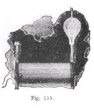


"Wenn man den Wechsel der Luftmoleküle vollständig verhindert, so kann die lokale Wärmewirkung derart erhöht werden, dass ein Körper zum Glühen gebracht wird. Wenn z. B. ein kleiner Knopf oder lieber ein sehr dünner Draht oder Faden in eine nicht evakuierte Kugel eingeschlossen und mit der Klemme der Spule verbunden wird, so kann derselbe glühend gemacht werden. Die Erscheinung wird noch interessanter dadurch, dass sich das obere Ende des Fadens rasch im Kreise, herumbewegt und dadurch das Aussehen eines leuchtenden Trichters darbietet (Fig. 111), welcher sich bei wachsender Spannung erweitert. Ist die Spannung niedrig, so kann das Ende des Fadens unregelmäßige Bewegungen ausführen, indem es plötzlich aus der einen in die andere Bewegung übergeht, oder es kann eine Ellipse beschreiben; ist die Spannung aber sehr hoch, so bewegt es sich stets in einem Kreise, und so bewegt sich im Allgemeinen ein dünner gerader Draht, der frei an der Klemme der Spule befestigt ist. Diese Bewegungen haben ihren Grund in dem Anprall der Moleküle und in der Unregelmäßigkeit der Spannungsverteilung infolge der unebenen und unsymmetrischen Beschaffenheit des Drahtes oder Fadens. Bei einem vollkommen symmetrischen und glatten Drahte würden solche Bewegungen wahrscheinlich nicht vorkommen. Dass die Bewegung aller Wahrscheinlichkeit nach nicht von andern Ursachen herrührt, geht aus der Tatsache hervor, dass sie keine bestimmte Richtung hat und in einer sehr stark evakuierten Kugel ganz aufhört. Die Möglichkeit, einen Körper in einer evakuierten Kugel oder auch, wenn er gar nicht eingeschlossen ist, zum Glühen zu bringen, dürfte einen Weg zeigen, Lichtwirkungen hervorzubringen, die nach Vervollkommnung der Methoden zur Erzeugung rasch wechselnder Spannungen zu nützlichen Zwecken verwertet werden könnten. 

Bei Anwendung einer käuflichen Spule ist die Erzeugung sehr kräftiger Büschelwirkungen mit erheblichen Schwierigkeiten verbunden, da, wenn solche hohen Frequenzen und enormen Spannungen benutzt werden, auch die beste Isolation nicht Stand zu halten vermag. In der Regel ist die Spule gut genug isoliert, um der Spannung von Windung zu Windung zu widerstehen, da zwei mit doppelter Seidenumspinnung versehene paraffinierte Drähte eine Spannung von mehreren tausend Volt aushalten. Die Schwierigkeit liegt hauptsächlich darin, das Durchschlagen von der sekundären Spule nach der primären, welches durch die von letzterer ausgehenden Strömungen bedeutend erleichtert wird, zu verhindern. In der Spule ist die Beanspruchung von Abteilung zu Abteilung am größten, gewöhnlich aber sind bei einer größeren Spule so viele Abteilungen vorhanden, dass die Gefahr eines plötzlichen Durchschlagens nicht sehr groß ist. Nach dieser Richtung begegnet man im Allgemeinen keiner Schwierigkeit und überdies wird die Möglichkeit einer inneren Beschädigung der Spule durch den Umstand sehr verringert, dass die höchst wahrscheinlich erzeugte Wirkung einfach eine allmähliche Erwärmung ist, die, weit genug vorgeschritten, der Beobachtung nicht entgehen kann. Das Haupterfordernis ist also, die Strömungen zwischen der primären Spule und der Röhre zu verhüten, nicht allein wegen der Erwärmung und möglichen Beschädigung, sondern auch weil die Strömungen die an den Klemmen verwertbare Spannungsdifferenz sehr erheblich vermindern können. Einige Andeutungen darüber, wie dies geschehen kann, dürften daher bei den meisten dieser Versuche, wenn sie mit der gewöhnlichen Induktionsspule ausgeführt werden, sich nützlich erweisen.


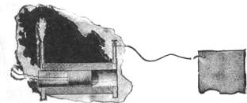


Eins dieser Mittel besteht darin, dass man eine kurze Primärspule wickelt (Fig. 112 a), so dass die Spannungsdifferenz bei dieser Länge nicht groß genug ist, um das Durchbrechen der Strömungen durch die isolierende Röhre zu veranlassen. Die Länge der primären Spule sollte durch den Versuch bestimmt werden. Beide Enden der Spule sind an einem und demselben. Ende durch einen in die Röhre hineinpassenden Stöpsel aus isolierendem Material, wie in der Figur dargestellt, nach außen zu führen. Bei einer solchen Anordnung wird das eine Ende der sekundären Spule an einem Körper befestigt, dessen Oberfläche mit der größten Sorgfalt derart bestimmt wird, dass er die größte Spannungssteigerung erzeugt. An dem andern Ende erscheint dann ein mächtiges Büschel, mit dem man experimentieren kann. 

Die obige Methode erfordert die Anwendung einer Primärspule von geringer Größe und letztere erwärmt sich leicht, wenn kräftige Wirkungen eine gewisse Zeit hindurch wünschenswert sind. 

In solchem Falle ist es besser, eine größere Spule anzuwenden (Fig. 112b) und dieselbe von der einen Seite in die Röhre einzuführen, bis die Strömungen zum Vorschein kommen. In diesem Falle kann das nächste Ende der sekundären Spule mit der Primärspule oder mit der Erde verbunden werden, was praktisch dasselbe ist, wenn die Primärspule direkt mit der Maschine verbunden ist. Im Falle von Erdverbindungen tut man gut, die Frequenz, welche für die Bedingungen des Versuchs am besten geeignet ist, experimentell zu bestimmen. Ein anderes Verfahren, die Strömungen mehr oder weniger zu verhüten, besteht darin, dass man die Primärspule in AbTeilungen herstellt und ihr den Strom aus getrennten gut isolierten Stromquellen zuführt. 


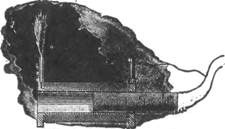


Bei manchen von diesen Versuchen, bei welchen kräftige Wirkungen nur eine kurze Zeit hindurch gewünscht werden, ist es vorteilhaft, Eisenkerne in den Primärspulen zu benutzen. In einem derartigen Falle kann man eine sehr große primäre Spule wickeln und dieselbe neben die sekundäre Spule setzen; und nachdem man das nächste Ende der letzteren mit der primären Spule verbunden hat, führt man einen unterteilten Eisenkern durch die Primärspule hindurch in die sekundäre Spule hinein, soweit als es die Strömungen gestatten. Unter diesen Verhältnissen kann man ein außerordentlich kräftiges Büschel von mehreren Zoll Länge, dass man passend „St. Elms-Glühfeuer" nennen kann, an dem andern Pole der sekundären Spule hervorbringen, was überraschende Effekte erzeugt. Es ist ein sehr kräftiger Ozonerzeuger, ein so kräftiger in der Tat, dass nur wenige Minuten genügen, um den ganzen Raum mit dem Ozongeruch zu erfüllen, und es besitzt unzweifelhaft die Eigenschaft, chemische Wirkungen hervorzubringen. 

Zur Erzeugung von Ozon sind Wechselströme von sehr hoher Frequenz in hervorragendem Maße geeignet, nicht nur mit Rücksicht auf die Vorteile, welche sie bezüglich der Umwandlung bieten, sondern auch infolge des Umstandes, dass die ozonisierende Wirkung einer Entladung sowohl von der Frequenz als auch von der Spannung abhängig ist, was unzweifelhaft durch Beobachtung bestätigt wird. 

Wird bei diesen Versuchen ein Eisenkern benutzt, so muss man auf denselben sorgfältig Acht geben, da derselbe in unglaublich kurzer Zeit außerordentlich heiß zu werden vermag. Um eine Vorstellung von der Schnelligkeit der Erwärmung zu geben, will ich anführen, dass, wenn man einen kräftigen Strom durch eine Spule von vielen Windungen hindurchschickt, man in dieselbe einen dünnen Eisendraht nicht länger als eine Sekunde hineinzuschieben braucht, um denselben auf etwa 100°C zu erwärmen. 

Aber diese rasche Erwärmung braucht uns nicht abzuhalten, bei rasch wechselnden Strömen Eisenkerne zu verwenden. Ich habe schon seit längerer Zeit die Überzeugung gewonnen, dass bei der industriellen Energie-Verteilung mittels Transformatoren etwa ein Plan wie der folgende praktisch sein würde. "Wir können einen kleinen, unterteilten oder vielleicht nicht einmal unterteilten Eisenkern benutzen. Diesen Kern können wir mit einem feuerbeständigen und die Wärme schlecht leitenden Material von beträchtlicher Dicke umgeben und darüber die primären und sekundären Windungen anbringen. Indem wir dann entweder höhere Frequenzen oder größere magnetisierende Kräfte anwenden, können wir durch Hysteresis und Wirbelströme den Eisenkern so weit erhitzen, dass er nahezu auf das Maximum seiner Permeabilität kommt, welches, wie Hopkinson gezeigt hat, etwa sechzehnmal grösser sein kann als bei gewöhnlichen Temperaturen. Wenn der Eisenkern vollständig eingeschlossen ist, würde er durch die Hitze nicht Schaden leiden, und wenn die Umhüllung mit feuersicherem Material dick genug ist, so würde trotz der hohen Temperatur nur ein geringer Betrag an Energie durch Strahlung verloren gehen. Nach diesem Plane sind Transformatoren von mir konstruiert worden, aber aus Mangel an Zeit konnten bisher keine eingehenden Versuche ausgeführt werden. 

Ein anderes Verfahren, um den Eisenkern bei rasch wechselnden Strömen zu verwenden oder, allgemein gesprochen, die Reibungsverluste zu verringern, besteht darin, dass man durch fortgesetzte Magnetisierung einen Fluss von ungefähr siebentausend oder achttausend Kraftlinien per Quadratzentimeter durch den Kern hindurch erzeugt und dann um den Punkt der größten Permeabilität herum mit schwachen magnetisierenden Kräften und vorzugsweise hohen Frequenzen arbeitet. In dieser Weise lässt sich ein höherer Wirkungsgrad der Transformation und eine größere Leistungsfähigkeit erreichen. Ich habe dieses Prinzip auch in Verbindung mit Maschinen angewendet, bei denen keine Umkehrung der Polarität stattfindet. Bei diesen Maschinentypen erzielt man, so lange dieselben nur wenige Polvorsprünge haben, keinen großen Vorteil, da die Maxima und Minima der Magnetisierung weit ab von dem Punkte der größten Permeabilität liegen; wenn aber die Anzahl der Polvorsprünge sehr groß ist, so kann man die erforderliche Schnelligkeit der Stromwechsel erreichen, ohne die Magnetisierung so weit zu variieren, dass man sich beträchtlich von dem Punkte der größten Permeabilität entfernt, was einen erheblichen Gewinn bedeutet. 


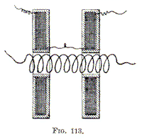


Die oben beschriebenen Anordnungen beziehen sich nur auf den Gebrauch im Handel käuflicher Spulen, wie sie gewöhnlich hergestellt werden. Will man eine Spule speziell zu dem Zwecke herstellen, um mit ihr solche Versuche, wie ich sie beschrieben habe, anzustellen, oder allgemein, um sie zu befähigen, die größtmöglichen Spannungsdifferenzen auszuhalten, so dürfte sich eine Konstruktion, wie sie in Fig. 113 angedeutet ist, als vorteilhaft erweisen. Die Spule wird in diesem Falle aus zwei voneinander unabhängigen, entgegengesetzt gewickelten Teilen gebildet und die Verbindung zwischen beiden wird nahe an der Primärspule hergestellt. Da die Spannung in der Mitte Null ist, so besteht kein großes Bestreben, auf die Primärspule überzuspringen, und es ist keine starke Isolation erforderlich. In einigen Fällen kann man indessen den mittleren Punkt mit der primären Spule oder mit der Erde verbinden. Bei einer solchen Spule liegen die Stellen größter Spannungsdifferenz weit ab voneinander und die Spule vermag einer enormen Spannung zu widerstehen. Die beiden Teile können beweglich sein, um eine kleine Regulierung der Kapazitätswirkung zu ermöglichen. 

Was die Art der Isolierung der Spule anbelangt, so wird sich das folgende Verfahren als zweckmäßig erweisen. Zunächst siede man den Draht in Paraffinöl, bis alle Luft ausgetrieben ist. Dann wickele man die Spule, indem man den Draht durch geschmolzenes Paraffin laufen lässt, letzteres nur zu dem Zwecke, um den Draht festzulegen. Die Spule wird dann von dem Zylinder abgenommen und in ein mit reinem geschmolzenen Wachs gefülltes zylindrisches Gefäß getaucht und so lange gekocht, bis keine Blasen mehr erscheinen. Das Ganze wird dann stehen gelassen, um es vollständig abzukühlen, und darauf wird die Masse aus dem Gefäß herausgenommen und auf einer Drehbank abgedreht. Eine in solcher Weise und mit Sorgfalt hergestellte Spule vermag enormen Spannungsdifferenzen zu widerstehen. 

Es kann zweckmäßig sein, die Spule in Paraffinöl oder irgendeine andere Art Öl einzutauchen. Es ist dies ein sehr wirksames Isolierungsverfahren, insbesondere wegen der vollständigen Ausschließung der Luft; indessen dürfte ein mit Öl gefülltes Gefäß gerade kein Gegenstand sein, mit dem man in einem Laboratorium bequem hantieren kann. 

Wenn eine gewöhnliche Spule auseinandergenommen werden kann, so kann man die primäre Spule aus der Röhre herausnehmen, die letztere an dem einen Ende zustöpseln, das Öl hineinfüllen und die Primärspule wieder einsetzen. Dies gibt eine ausgezeichnete Isolation und verhütet die Bildung von Büschelentladungen. Unter allen Versuchen, welche mit rasch wechselnden Strömen angestellt werden können, sind diejenigen, welche die Herstellung eines praktischen Beleuchtungsmittels betreffen, die interessantesten. Es lässt sich nicht leugnen, dass die gegenwärtigen Methoden, wenn sie auch glänzende Fortschritte bedeuteten, sehr unökonomisch sind. Es müssen bessere Methoden erfunden, vollkommenere Apparate ersonnen werden. Die neueren Untersuchungen haben neue Möglichkeiten für die Erzeugung einer wirksameren Lichtquelle eröffnet und die allgemeine Aufmerksamkeit hat sich der von geschickten Pionieren angegebenen Richtung zugewendet. Viele haben sich durch die Begeisterung und die Sucht, etwas zu entdecken, fortreißen lassen, aber in ihrem Eifer, Resultate zu erreichen, sind sie irregeführt worden. In der Absicht, elektromagnetische Wellen zu erzeugen, wandten sie ihre Aufmerksamkeit vielleicht zu sehr dem Studium der elektromagnetischen Wirkungen zu und vernachlässigten das Studium der elektrostatischen Erscheinungen. Naturgemäß bedient sich fast jeder Forscher eines Apparates, der dem. bei früheren Experimenten angewendeten ähnlich ist. Während aber bei Apparaten dieser Art die elektromagnetischen Induktionswirkungen enorm sind, sind die elektrostatischen Wirkungen außerordentlich gering. 

Bei den Hertz'schen Versuchen z. B. wird eine Induktionsspule hoher Spannung kurz geschlossen durch einen Bogen, dessen Widerstand sehr klein ist, und zwar umso kleiner, je mehr Kapazität an den Klemmen angebracht ist, und die Spannungsdifferenz an diesen wird dadurch enorm verringert. Andererseits können, wenn die Entladung zwischen den Polen nicht übergeht, die statischen Wirkungen beträchtlich sein, aber nur qualitativ, nicht quantitativ, da ihre Zunahme und Abnahme sehr plötzlich und ihre Frequenz sehr gering sind. In keinem Falle sind daher mächtige elektrostatische Wirkungen wahrnehmbar. Analoge Verhältnisse bestehen, wenn es sich, wie bei einigen interessanten Versuchen von Dr. Lodge, um die disruptive Entladung Leydener Flaschen handelt. Man dachte sich die Sache so und behauptete es auch, wie ich glaube, dass in solchen Fällen der größte Teil der Energie in den Raum ausgestrahlt wird. Im Lichte der oben beschriebenen Versuche wird man diesen Gedanken aufgeben müssen. Ich bin überzeugt, dass in solchen Fällen der größte Teil der Energie in dem Entladungsbogen sowie in dem leitenden und isolierenden Material der Flasche verzehrt und in Wärme verwandelt wird, obwohl allerdings ein Teil der Energie durch Elektrisierung der Luft verbraucht wird; indessen ist der Betrag der direkt ausgestrahlten Energie sehr gering. 

Wenn eine mit Wechselströmen von nur 20000 Wechseln per Sekunde betriebene Induktionsspule hoher Spannung durch eine selbst nur kleine Flasche geschlossen wird, so geht praktisch die ganze Energie durch das Dielektrikum der Flasche, welches erwärmt wird, hindurch und die elektrostatischen Wirkungen äußern sich außerhalb nur in sehr schwachem Grade. Nun kann man den äußeren Stromkreis einer Leydener Flasche, d. h. den Bogen und die Verbindungen der Belegungen, als einen Stromkreis betrachten, welcher "Wechselströme von außerordentlich hoher Frequenz und ziemlich hoher Spannung erzeugt und durch die Belegungen und das Dielektrikum zwischen ihnen geschlossen ist, und aus dem Obigen geht hervor, dass die äußeren elektrostatischen Wirkungen sehr gering sein müssen, selbst wenn noch ein zweiter (alternativer) Entladungsstromkreis angewendet wird. Diese Verhältnisse zeigen, dass bei den gewöhnlich zur Verfügung stehenden Apparaten die Beobachtung mächtiger elektrostatischer Wirkungen unmöglich war, und was durch die Erfahrung nach dieser Richtung bekannt geworden ist, ist nur der großen Geschicklichkeit der Forscher zu verdanken. 

Nach der Theorie sind aber mächtige elektrostatische Wirkungen eine unerlässliche Bedingung für die Lichterzeugung. Elektromagnetische Wirkungen sind primär deshalb unverwendbar, weil man, um die gewünschten Wirkungen hervorzubringen, Stromstöße durch einen Leiter zu schicken hätte, der, lange bevor die erforderliche Frequenz der Stromstöße erreicht werden könnte, aufhören würde, dieselben fortzupflanzen. Andererseits scheint es, dass elektromagnetische Wellen von vielmal größerer Länge als diejenigen des Lichtes, wie sie durch plötzliche Entladung eines Kondensators erzeugt werden können, nicht verwendbar sind, wir müssten denn ihre Wirkungen auf Leiter benutzen, wie in den jetzigen Methoden, welche sehr unökonomisch sind. Mittels solcher "Wellen könnten wir die statischen Ladungen der Moleküle oder Atome eines Gases nicht beeinflussen und dieselben zu Schwingungen und zur Lichtemission veranlassen. Lange transversale "Wellen können solche Wirkungen anscheinend nicht hervorbringen, da außerordentlich kleine elektromagnetische Störungen leicht meilenweit durch die Luft sich fortpflanzen. Solche dunklen Wellen können, wie es scheint, nicht die leuchtende Strahlung in einer Geissler'schen Röhre erregen, wofern sie nicht die Länge wirklicher Lichtwellen haben, und ich bin geneigt, die Lichtwirkungen, welche durch Induktion in einer elektrodenlosen Röhre hervorgebracht werden können, als solche von elektrostatischer Natur zu betrachten. 

Um solche Lichtwirkungen hervorzubringen, sind gerade elektrostatische Stöße erforderlich; diese können, welches auch ihre Frequenz sein möge, die molekularen Ladungen stören und Licht erzeugen. Da Stromstöße von der erforderlichen Frequenz nicht durch einen Leiter von messbaren Dimensionen hindurchgehen können, so müssen wir mit einem Gase arbeiten, und dann wird die Erzeugung kräftiger elektrostatischer Wirkungen eine gebieterische Notwendigkeit. 

Ich habe jedoch bemerkt, dass elektrostatische Wirkungen auf mannigfache Weise zur Erzeugung von Licht verwertet werden können. Wir können z. B. einen Körper aus irgendeinem feuerbeständigen Material in eine geschlossene und noch besser mehr oder weniger evakuierte Kugel setzen, denselben mit einer Quelle von hoher rasch wechselnder Spannung verbinden und dadurch bewirken, dass die Gasmoleküle denselben viele Male in der Sekunde mit ungeheuren Geschwindigkeiten treffen und ihn auf diese Weise wie mit Trillionen unsichtbarer Hämmer schlagen, bis er glühend wird. Oder wir können einen Körper in eine in sehr hohem Grade luftleer gemachte Kugel, also in ein nicht mehr zu durchschlagendes Vakuum bringen und durch Anwendung sehr hoher Frequenzen und Spannungen hinreichende Energie von ihm auf andere Körper in der Nähe oder überhaupt auf die Umgebung übertragen, um sie auf jedem beliebigen Grade des Glühens zu erhalten; oder wir können endlich mit Hilfe solcher schnell wechselnden hohen Spannungen den von den Molekülen eines Gases mitgeführten Äther oder ihre statischen Ladungen stören und sie dadurch veranlassen zu vibrieren und Licht auszusenden. 

Da aber elektrostatische Wirkungen von der Spannung und der Frequenz abhängig sind, so ist es wünschenswert, um die kräftigste Wirkung hervorzubringen, beide so weit als praktisch ausführbar zu steigern. Es ist möglich, recht hübsche Resultate dadurch zu erhalten, dass man den einen dieser Faktoren niedrig hält, falls nur der andere genügend groß ist; jedoch ist man in beiden Richtungen beschränkt. Meine Erfahrung hat gezeigt, dass man nicht unter eine gewisse Frequenz hinabgehen darf, denn erstens wird die Spannung dann so groß, dass sie gefährlich ist, und zweitens ist die Lichterzeugung weniger wirkungsvoll. 

Ich habe gefunden, dass bei Anwendung der gewöhnlichen niedrigen Frequenzen die physiologische Wirkung des Stromes, welcher erforderlich ist, um eine 120 cm lange, an beiden Enden mit äußeren und inneren Kondensatorbelegungen versehene Röhre auf einem gewissen Helligkeitsgrade zu erhalten, so kräftig ist, dass sie diejenigen, welche an solche Schläge nicht gewöhnt sind, ernstlich verletzen dürfte, während dagegen bei zwanzigtausend Wechseln per Sekunde die Röhre auf demselben Helligkeitsgrade gehalten werden kann, ohne dass man irgendwelche Wirkung auf sich fühlt. Dies rührt hauptsächlich von der Tatsache her, dass zur Erzeugung der nämlichen Lichtwirkung eine viel kleinere Spannung erforderlich ist, und ferner von dem höheren Wirkungsgrade der Lichterzeugung. Offenbar ist in solchen Fällen der Wirkungsgrad umso grösser, je höher die Frequenz ist; denn je schneller der Prozess der Ladung und der Entladung der Moleküle vor sich geht, umso weniger Energie wird in Form der dunklen Strahlung verloren. Leider aber können wir wegen der Schwierigkeit der Erzeugung und Fortleitung der Wirkungen nicht über eine gewisse Frequenz hinausgehen. 

Ich habe oben angeführt, dass ein in eine nicht evakuierte Kugel eingeschlossener Körper einfach durch Verbindung mit einer Quelle von rasch wechselnder Spannung intensiv erhitzt werden kann. Die Erwärmung ist in solchem Falle höchstwahrscheinlich zum größten Teil dem Anprallen der in der Kugel enthaltenen Gasmoleküle zuzuschreiben. Ist die Kugel evakuiert, so erfolgt die Erwärmung des Körpers viel schneller und es ist durchaus nicht schwierig, einen Draht oder Faden zu irgendeinem Grade des Glühens zu bringen dadurch, dass man ihn einfach mit einem Ende einer Spule von geeigneten Dimensionen verbindet. Wird z.B. der bekannte Apparat von Prof. Crookes, welcher aus einem gebogenen Platindraht mit darüber montierten Flügeln besteht (Fig. 114), mit einem Pole der Spule verbunden, und zwar kann entweder nur ein Ende oder beide Enden des Platindrahtes angeschlossen werden, so wird der Draht fast augenblicklich glühend, und die Glimmerflügel rotieren, als ob ein Batteriestrom benutzt würde. Ein dünner Kohlenfaden oder, noch besser, ein Knopf von irgendwelchem feuerbeständigem Material (Fig. 115), auch wenn dasselbe ein verhältnismäßig schlechter Leiter ist, der in eine evakuierte Kugel eingeschlossen ist, kann hochglühend gemacht werden, und auf diese Weise ist eine einfache Lampe hergestellt, die jede gewünschte Kerzenstärke zu geben vermag. 

Der Erfolg von Lampen dieser Art würde hauptsächlich von der Wahl der in der Kugel enthaltenen lichtspendenden Körper abhängen. Da sich unter den beschriebenen Verhältnissen feuerbeständige Körper — welche sehr schlechte Leiter sind und lange Zeit hindurch außerordentlich hohen Wärmegraden zu widerstehen vermögen — benutzen lassen, so dürfte man mit solchen Beleuchtungsvorrichtungen möglicher Weise Erfolge erzielen können. 


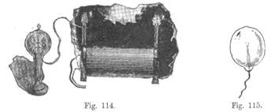


Man könnte zunächst denken, dass, wenn die den Faden oder Knopf aus feuerbeständigem Material enthaltende Kugel vollkommen luftleer gemacht ist, d. h. soweit es eben mit Hilfe der besten Apparate geschehen kann, die Erwärmung viel weniger intensiv sein sollte und dass sie in einem vollkommenen Vakuum überhaupt nicht stattfinden könnte. Dies wird durch meine Erfahrung nicht bestätigt; im Gegenteil, je besser das Vakuum, umso leichter werden die Körper zum Glühen gebracht. Dies Resultat ist aus verschiedenen Gründen interessant. 

Gleich im Anfang dieser Arbeit kam mir der Gedanke, ob vielleicht zwei Körper aus feuerbeständigem Material, die in eine Kugel eingeschlossen sind, welche bis zu einem solchen Grade luftleer gemacht ist, dass die Entladung einer großen in der gewöhnlichen Weise betriebenen Induktionsspule nicht mehr hindurchzugehen vermag, durch bloße Kondensatorwirkung glühend gemacht werden könnten. Offenbar sind, zur Erreichung dieses Resultats enorme Spannungsdifferenzen und sehr hohe Frequenzen erforderlich, wie eine einfache Rechnung zeigt. 

Eine solche Lampe würde indessen hinsichtlich des Wirkungsgrades einen bedeutenden Vorteil vor einer gewöhnlichen Glühlampe voraushaben. Bekanntlich ist der Wirkungsgrad einer Lampe bis zu gewissem Grade eine Funktion des Glühgrades und der Wirkungsgrad würde viel grösser sein, wenn wir nur im Stande wären, einen Kohlenfaden auf einen vielfach höheren Glühgrad zu bringen. Bei einer gewöhnlichen Lampe ist dies Anregen der Zerstörung des Kohlenfadens nicht angängig und durch die Erfahrung ist bestimmt worden, wie weit man zweckmäßig die Glut treiben kann. Es ist unmöglich zu sagen, ein wie viel höherer Wirkungsgrad erreicht werden könnte, wenn der Faden einen unendlich großen Widerstand besäße, da eine zu diesem Behufe angestellte Untersuchung offenbar nicht über eine gewisse Grenze hinausgeführt werden kann; es sprechen jedoch gewisse Gründe dafür, dass derselbe sehr beträchtlich höher sein würde. Eine Verbesserung könnte bei der gewöhnlichen Lampe durch Anwendung einer kurzen und dicken Kohle erreicht werden; alsdann aber würden die Einführungsdrähte dick sein müssen und außerdem lassen noch viele andere Erwägungen eine solche Modifikation als vollständig unausführbar erscheinen. Bei einer solchen Lampe, wie oben beschrieben, aber können die Einführungsdrähte sehr dünn sein, das glühende feuerbeständige Material kann die Form von Klötzchen haben, die eine sehr kleine strahlende Oberfläche darbieten, so dass weniger Energie erforderlich sein würde, um dieselben auf der gewünschten Gluth zu erhalten, und überdies braucht das feuerbeständige Material nicht Kohle zu sein, sondern kann aus Mischungen z. B. von Oxyden mit Kohle oder anderem Material hergestellt werden oder es kann aus Körpern genommen werden, welche praktisch Nichtleiter und im Stande sind, enormen Temperaturgraden zu widerstehen. 

Alles dies weist auf die Möglichkeit hin, dass man mit einer solchen Lampe einen viel höheren Wirkungsgrad erreichen kann, als er sich bei gewöhnlichen Lampen erzielen lässt. Bei meinen Versuchen hat sich ergeben, dass die Klötzchen mit viel geringeren Spannungen, als die Rechnung ergeben hatte, zu hohen Glühgraden gebracht und in größeren Entfernungen voneinander angebracht werden können. Man darf getrost annehmen, und die Wahrscheinlichkeit spricht dafür, dass das Bombardement der Moleküle ein wichtiges Element bei der Erwärmung ist, selbst wenn die Kugel mit der größten Sorgfalt, wie ich es getan habe, evakuiert wird; denn obwohl die Zahl der Moleküle in diesem Falle, vergleichsweise gesprochen, unbedeutend ist, finden doch, weil der mittlere freie Weg sehr groß ist, weniger Zusammenstöße statt und die Moleküle können weit höhere Geschwindigkeiten erreichen, so dass die aus dieser Ursache herrührende Wärmewirkung, wie bei den Crookes'schen Versuchen mit strahlender Materie, erheblich sein kann. Es ist aber auch möglich, dass die Moleküle in einem sehr hohen Vakuum, wenn die Spannung sich rasch ändert, leichter ihre Ladung verlieren, in welchem Falle der größte Teil der Erwärmung direkt von dem Hin- und Herwogen der Ladungen in den erwärmten Körpern herrühren würde. Oder sonst könnte die beobachtete Tatsache hauptsächlich der Wirkung der Spitzen zuzuschreiben sein, von der ich oben gesprochen habe und infolge deren die in dem Vakuum enthaltenen Klötzchen oder Fäden Kondensatoren von vielmal größerer Oberfläche, als aus ihren geometrischen Dimensionen folgen würde, äquivalent sind. Die Gelehrten sind noch nicht darüber einig, ob eine Ladung sich in einem vollkommenen Vakuum verliert oder nicht, oder mit andern "Worten, ob der Äther ein Leiter ist oder nicht. Wäre das erstere der Fall, so würde ein dünner Kohle faden, welcher in eine vollkommen luftleer gemachte Kugel eingeschlossen und mit einer Quelle von enormer konstanter Spannung verbunden ist, zum Glühen gebracht werden. 

Klötzchen oder Fäden Kondensatoren von vielmal größerer Oberfläche, als aus ihren geometrischen Dimensionen folgen würde, äquivalent sind. Die Gelehrten sind noch nicht darüber einig, ob eine Ladung sich in einem vollkommenen Vakuum verliert oder nicht, oder mit andern "Worten, ob der Äther ein Leiter ist oder nicht. Wäre das erstere der Fall, so würde ein dünner Kohle faden, welcher in eine vollkommen luftleer gemachte Kugel eingeschlossen und mit einer Quelle von enormer konstanter Spannung verbunden ist, zum Glühen gebracht werden. 


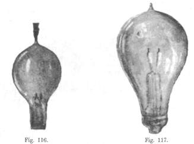


Ich habe verschiedene Formen von Lampen nach dem oben beschriebenen Prinzip, deren feuerbeständige Körper die Form von Fäden (Fig. 116) oder Klötzchen (Fig. 117) hatten, hergestellt und in Betrieb gesetzt, und weitere Untersuchungen nach dieser Richtung hin sind im Gange. Es hat keine Schwierigkeit, derartig hohe Glühgrade zu erreichen, dass gewöhnliche Kohle allem Anschein nach geschmolzen und verflüchtigt wird. Wenn ein absolut vollkommenes Vakuum hergestellt werden könnte, würde eine solche Lampe, obwohl sie bei den gewöhnlich angewandten Apparaten nicht zu brauchen ist, wenn mit Strömen, von' der erforderlichen Art betrieben, ein Beleuchtungsmittel darstellen, welches unzerstörbar und bei weitem leistungsfähiger sein würde als eine gewöhnliche Glühlampe. Diese Vollkommenheit lässt sich nie erreichen, und es wird eine sehr langsame Zerstörung und allmähliche Abnahme im. Querschnitt immer eintreten, wie bei gewöhnlichen Glühlampenfäden; aber es ist keine Möglichkeit einer plötzlichen und vorzeitigen Unbrauchbarkeit vorhanden, wie sie bei Letzteren durch den Bruch des Fadens eintritt, besonders dann nicht, wenn die Glühkörper die Form von Klötzchen haben. 

Bei diesen rasch wechselnden Spannungen ist es aber durchaus nicht notwendig, zwei Klötzchen in eine Kugel einzuschließen, sondern es kann ein einziger Klotz, wie in Fig. 115, oder ein einziger Faden, wie in Fig. 118, benutzt werden. Die Spannung muss in diesem Falle höher sein, dieselbe lässt sich aber leicht erreichen und ist außerdem nicht notwendig gefährlich. 


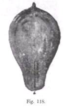


Die Leichtigkeit, mit welcher der Knopf oder Faden in einer solchen Lampe zum Glühen gebracht wird, hängt unter sonst gleichen Umständen von der Größe der Kugel ab. Wäre ein vollkommenes Vakuum erreichbar, so würde die Größe der Kugel nicht von Bedeutung sein, denn dann würde die Erwärmung vollständig von dem Fluktuieren der Ladungen herrühren, und die gesamte Energie würde durch Strahlung an die Umgebung abgegeben werden. Aber dies kann in der Praxis nie eintreten. Es bleibt stets etwas Gas in der Kugel zurück, und wenn auch die Luftentleerung bis zum höchsten Grade getrieben wird, so muss doch der Baum innerhalb der Kugel als leitend angesehen werden, wenn so hohe Spannungen benutzt werden, und ich nehme an, dass man zur Beurteilung der Energie, welche von dem Faden an die Umgebung abgegeben werden kann, die innere Fläche der Kugel als die eine Belegung eines Kondensators betrachten kann, während die Luft und die andern in der Umgebung der Kugel befindlichen Gegenstände die andere Belegung bilden. Wenn die Stromwechsel sehr langsam sind, so wird ohne Zweifel ein erheblicher Teil der Energie durch die Elektrisierung der umgebenden Luft verbraucht. 

Um diesen Gegenstand besser zu studieren, führte ich einige Versuche mit außerordentlich hohen Spannungen und niedrigen Frequenzen aus. Ich beobachtete dann, dass man, wenn man die Hand der Lampenbirne nähert — während der Faden mit der einen Klemme der Spule verbunden ist — ein kräftiges Zittern fühlt, welches von der Anziehung und Abstoßung der Luftmoleküle, die durch Induktion durch das Glas hindurch elektrisiert werden, herrührt. In einigen Fällen, wo die Wirkung sehr intensiv war, konnte ich einen Ton hören, der derselben Ursache zuzuschreiben ist.

Wenn die Zahl der Strom Wechsel gering ist, so kann man einen außerordentlich kräftigen Schlag von der Lampenbirne erhalten. Im Allgemeinen sollte man, wenn man Lampenbirnen oder Gegenstände von einiger Größe an den Klemmen der Spule anbringt, auf die Erhöhung der Spannung Acht geben, da es vorkommen kann, dass durch bloßes Befestigen einer Glasbirne oder Platte an der Klemme, die Spannung bis zu einem Vielfachen ihres ursprünglichen Wertes steigt. Werden Lampen an den Klemmen angebracht, wie in Fig. 119 dargestellt, so soll die Kapazität der Birnen derart sein, dass sie unter den obwaltenden Verhältnissen die größte Spannungserhöhung gibt. Auf diese Weise kann man die erforderliche Spannung mit weniger Drahtwindungen erhalten. 
Das Leben solcher Lampen, wie oben beschrieben, hängt natürlich in bedeutendem Maaße von dem Grade der Evakuierung, in einigem Grade aber auch von der Form des Klotzes aus feuerbeständigem Material ab. Theoretisch betrachtet sollte eine kleine in eine Glaskugel eingeschlossene Kohlenkugel keinen Verschleiß durch das Bombardement der Moleküle erleiden; denn wenn die Materie in der Kugel strahlend wäre, so würden sich die Moleküle in geraden Linien bewegen und selten die Kugel in schräger Richtung treffen. Ein interessanter Gedanke bezüglich einer solchen Lampe ist der, dass in ihr „Elektrizität" und elektrische Energie sich scheinbar in denselben Linien bewegen müssen. 


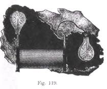


Die Verwendung von Wechselströmen von sehr hoher Frequenz ermöglicht es, mittels elektrostatischer oder elektromagnetischer Induktion durch das Glas der Lampe hindurch eine hinreichende Energiemenge zu übertragen, um einen Faden glühend zu erhalten und so die Einführungsdrähte zu beseitigen. Derartige Lampen sind bereits in Vorschlag gebracht worden, aber da es an geeigneten Apparaten fehlte, konnten sie nicht erfolgreich betrieben werden. Ich habe viele Formen von Lampen nach diesem Prinzip mit zusammenhängenden und unterbrochenen Fäden hergestellt und mit denselben experimentiert. Bei Verwendung eines in die Lampe eingeschlossenen sekundären Drahtes verbindet man vorteilhaft einen Kondensator mit dem sekundären Draht. Wird die Übertragung mittels elektrostatischer Induktion bewirkt, so sind natürlich die verwendeten Spannungen bei Frequenzen, wie man sie mit einer Maschine erhalten kann, sehr hoch. Z.B. ist bei einer Kondensatorfläche von 40 Quadratzentimetern, die nicht unpraktisch groß ist, und mit Glas von guter Qualität und 1 mm Dicke, wenn Wechselströme von 20000 Wechseln in der Sekunde gebraucht werden, die erforderliche Spannung annähernd 9000 Volt. Dies mag hoch erscheinen, aber da jede Lampe in den sekundären Stromkreis eines Transformators von sehr kleinen Dimensionen eingeschaltet werden kann, so würde das kein Nachteil sein und überdies keine gefährliche Beschädigung herbeiführen können. Die Transformatoren wären am besten sämtlich hintereinander zu schalten. Die Regulierung würde keine Schwierigkeiten bieten, da es sehr leicht ist, bei Strömen von solchen Frequenzen einen konstanten Strom zu unterhalten. 


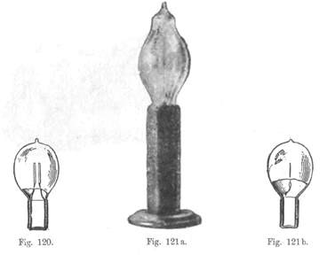


In den beigegebenen Figuren sind einige Lampentypen dieser Art dargestellt. Fig. 120 stellt eine solche Lampe mit unterbrochenem Faden und die Fig. 121a und 121b eine solche mit einer einzigen äußeren und inneren Belegung sowie einem einzigen Faden dar. Ich habe auch Lampen mit zwei äußeren und inneren Belegungen und einer kontinuierlichen die letzteren verbindenden Schleife hergestellt. Solche Lampen wurden von mir mit Stromstößen von jenen enormen Frequenzen betrieben, wie sie durch die disruptive Entladung von Kondensatoren erhalten werden. 

Die disruptive Entladung eines Kondensators ist für den Betrieb solcher Lampen ohne äußere elektrische Verbindungen mittels elektromagnetischer Induktion besonders geeignet, da die elektromagnetischen Induktionswirkungen außerordentlich hoch sind; ich war im Stande, den erforderlichen Glühgrad mit nur einigen wenigen kurzen Drahtwindungen hervorzubringen. Auch ein einfacher geschlossener Faden kann auf diese Weise zum Glühen gebracht werden. 
Indem ich nun von der praktischen Brauchbarkeit solcher Lampen absehe, will ich nur bemerken, dass sie eine schöne und erwünschte Eigenschaft besitzen, nämlich dass sie einfach durch Änderung der relativen Lage der äußeren und inneren Kondensatorbelegungen oder des indurierenden und indurierten Stromkreises nach Belieben mehr oder weniger hell brennend gemacht werden können. 


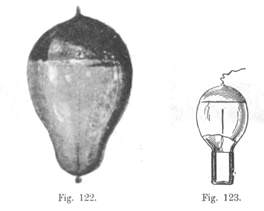


Wenn eine Lampe mit nur einer Klemme der Stromquelle verbunden ist, so kann man das Aufleuchten derselben erleichtern, wenn man die Kugel mit einer äußeren Kondensatorbelegung, welche zugleich als Reflektor dient, versieht und diese mit einem isolierten Körper von einigem Umfange verbindet. Lampen dieser Art sind in den Fig. 122 und 123 dargestellt, während Fig. 124 die Verbindungsweise zeigt. Die Helligkeit der Lampe kann in diesem Falle innerhalb weiter Grenzen durch Änderung der Größe der isolierten Metallplatte, mit welcher die Belegung verbunden ist, reguliert werden. 

 


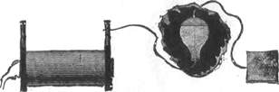


Man kann ferner auch Lampen mit einem Einführungsdraht, wie sie in Fig. 116 und Fig. 117 dargestellt sind, zum Leuchten bringen, wenn man eine Klemme der Lampe mit einer Klemme der Stromquelle und die andere Klemme mit einem isolierten Körper von dem erforderlichen Umfange verbindet. In allen Fällen dient der isolierte Körper dazu, die Energie an den umgebenden Raum abzugeben, und ist einer Rückleitung äquivalent. Offenbar könnte man in den beiden letztgenannten Fällen, anstatt die Drähte mit einem isolierten Körper zu verbinden, Verbindungen mit der Erde herstellen. 

Die für den Forscher anregendsten und interessantesten Versuche sind wahrscheinlich die, welche mit luftleeren Röhren ausgeführt wurden. "Wie man sich von vornherein denken kann, ist eine Quelle solcher rasch wechselnden Spannungen im Stande, die Röhren in beträchtlicher Entfernung zu erregen und bemerkenswerte Lichteffekte hervorzubringen. "Während meiner Untersuchungen nach dieser Richtung war ich bestrebt, Röhren, ohne alle Elektroden durch elektromagnetische Induktion zu erregen, indem ich die Röhre zum Sekundärkreis des Induktionsapparates machte und durch den Primärkreis die Entladungen einer Leydener Flasche hindurchschickte. Die Formen dieser Röhren waren verschiedenartig, und es wurden Lichteffekte erhalten, die ich damals vollständig der elektromagnetischen Induktion zuschrieb. Bei sorgfältiger Untersuchung der Erscheinungen fand ich aber, dass die erzeugten Wirkungen mehr elektrostatischer Natur seien. Es kann diesem Umstande zugeschrieben werden, dass diese Art, die Röhren zu erregen, sehr unökonomisch ist, weil nämlich bei geschlossenem Primärkreise die Spannung und demzufolge auch die elektrostatische Induktionswirkung viel kleiner wird. 

Bei Benutzung einer in der oben beschriebenen Weise betriebenen Induktionsspule werden unzweifelhaft die Röhren durch elektrostatische Induktion erregt und elektromagnetische Induktion hat, wenn überhaupt etwas, nur sehr wenig mit der Erscheinung zu tun. 
Dies geht aus vielen Versuchen hervor. Wird z. B. eine Röhre in die eine Hand genommen, während sich der Beobachter in der Nähe der Spule befindet, so wird sie brillant erleuchtet und bleibt so, gleichgültig in welcher Lage sie zum Körper des Beobachters gehalten wird. Wäre die Wirkung eine elektromagnetische, so könnte die Röhre nicht erleuchtet werden, wenn der Körper des Beobachters sich zwischen ihr und der Spule befindet, oder wenigstens würde ihre Leuchtkraft erheblich vermindert sein. Wird die Röhre genau über den Mittelpunkt der Spule gehalten — die letztere ist in Abteilungen gewickelt und die primäre Spule symmetrisch zur sekundären gelagert —, so bleibt sie vollständig dunkel, während sie intensiv leuchtend wird, wenn man sie vom Mittelpunkt der Spule aus etwas nach links oder rechts bewegt. Sie leuchtet deshalb nicht, weil in der Mitte beide Hälften der Spule einander neutralisieren und die elektrische Spannung Null ist. Wäre die Wirkung eine elektromagnetische, so müsste die Röhre am besten in der durch den Mittelpunkt der Spule gehenden Ebene leuchten, da die elektromagnetische Wirkung dort ein Maximum wäre. Wird zwischen den Polen ein Lichtbogen hergestellt, so verlöschen die Röhren und Lampen in der Nähe der Spule, leuchten aber, sobald der Bogen unterbrochen wird, wegen der Erhöhung der Spannung wieder auf. Und doch würde die elektromagnetische Wirkung in beiden Fällen praktisch dieselbe sein. 

Stellt man eine Röhre in einiger Entfernung von der Spule und näher an dem einen Pole — am besten in einem Punkte auf der Achse der Spule — auf, so kann man sie dadurch zum Leuchten bringen, dass man den entfernteren Pol mit einem isolierten Körper von gewissem Umfange oder mit der Hand berührt, wodurch die Spannung an dem der Röhre näher gelegenen Pole steigt. Wird die Röhre näher nach der Spule hinbewegt, so dass sie durch die "Wirkung des näheren Poles erleuchtet wird, so kann man sie dadurch zum Verlöschen bringen, dass man mit Hilfe einer isolierten Zange das Ende eines mit dem entfernten Pole verbundenen Drahtes in die Nähe des näher gelegenen Poles hält, wodurch man die Wirkung des letzteren auf die Röhre aufhebt. Diese Wirkungen sind elektrostatische. Wird ferner eine Röhre in einer beträchtlichen Entfernung von der Spule aufgestellt, so kann der Beobachter, welcher auf einem isolierten Ständer zwischen Spule und Röhre steht, die letztere dadurch zum Leuchten bringen, dass er die Hand derselben nähert, oder er kann sie sogar leuchtend machen, indem er einfach zwischen ihr und der Spule hin- und hergeht. Dies würde bei elektromagnetischer Induktion unmöglich sein, da der Körper des Beobachters wie ein Schirm wirken würde. 

Wenn die Spule durch sehr schwache Ströme erregt wird, so kann der Experimentator dadurch, dass er einen Pol. der Spule mit der Röhre berührt, die letztere auslöschen und sie wieder aufleuchten lassen, wenn er den Kontakt mit dem Pole aufhebt und einen kleinen Bogen sich bilden lässt. Dies rührt offenbar her von der respektiven Erniedrigung und Erhöhung der Spannung an jenem Pole. In dem obigen Versuch, wo die Röhre mittels eines kleinen Bogens leuchtend wird, kann dieselbe verlöschen, wenn der Bogen unterbrochen wird, da die elektrostatische Induktionswirkung allein zu schwach ist, obwohl die Spannung viel höher sein kann; wird jedoch der Bogen hergestellt, so ist die Elektrisierung am Ende der Röhre viel grösser und dieselbe leuchtet infolgedessen. 

Wenn eine Röhre dadurch zum Leuchten gebracht wird, dass man sie nahe an die Spule hält und mit der andern Hand die Röhre irgendwo aufesst, so wird der Teil zwischen den beiden Händen dunkel, und man kann die eigenartige Erscheinung, als ob man das Licht der Röhre auswische, erzeugen, indem man die Hand schnell über die Röhre hinführt und zu gleicher Zeit sie sanft von der Spule wegzieht, wobei man die Entfernung richtig abschätzt derart, dass die Röhre nachher dunkel bleibt. 
Wird die primäre Spule seitwärts gestellt, wie z. B. in Fig. 112b, und wird eine luftleer gemachte Röhre von der andern Seite in den hohlen Raum eingeführt, so wird die Röhre sehr intensiv leuchtend wegen der verstärkten Kondensatorwirkung, und in dieser Lage sind die Schichten sehr scharf begrenzt. In allen diesen beschriebenen Versuchen und in vielen andern ist die Wirkung offenbar eine elektrostatische. 

Die Schirmwirkungen weisen ebenfalls auf die elektrostatische Natur der Erscheinungen hin und lassen einigermaßen die Natur der Elektrisierung durch die Luft hindurch erkennen. Wird z. B. eine Röhre in die Richtung der Achse der Spule gesetzt, und eine isolierte Metallplatte zwischen sie gebracht, so wird die Röhre im Allgemeinen an Helligkeit zunehmen, oder wenn sie vorher von der Spule zu weit entfernt war, um zu leuchten, so kann sie durch Zwischenschiebung einer isolierten Metallplatte sogar zum Leuchten gebracht werden. Die Größe der Wirkungen hängt in gewissem Grade von dem umfange der Platte ab. Wenn die Metallplatte aber mit der Erde durch einen Draht verbunden ist, so wird die Zwischenschiebung derselben die Röhre stets zum Verlöschen bringen, auch wenn sie sehr nahe an der Spule sich befindet. Im Allgemeinen wird durch die Zwischenschiebung eines Körpers zwischen die Spule und die Röhre die Helligkeit der Röhre oder die Leichtigkeit, mit welcher sie aufleuchtet, vermehrt oder vermindert, je nachdem dadurch die Elektrisierung zu- oder abnimmt. Experimentiert man mit einer isolierten Platte, so darf man letztere nicht zu groß nehmen, da sie sonst wegen der großen Leichtigkeit, mit welcher sie die Energie an die Umgebung abgibt, im Allgemeinen eine abschwächende Wirkung erzeugt. 

Wird eine Röhre in einiger Entfernung von der Spule zum Leuchten gebracht und dann eine Platte aus Hartgummi oder einer andern isolierenden Substanz dazwischen gestellt, so kann die Röhre dadurch verlöschen. Die Zwischenschiebung des Dielektrikums vermehrt in diesem Falle die induktive Wirkung nur wenig, vermindert aber erheblich die Elektrisierung durch die Luft hindurch. 

In allen Fällen also, wo wir evakuierte Röhren mit Hilfe einer solchen Spule zum Leuchten bringen, rührt die Wirkung von der rasch wechselnden elektrostatischen Spannung her, und im Weiteren muss sie dem direkt von der Maschine erzeugten harmonischen Stromwechsel und nicht etwa einer Übereinanderlagerung von Schwingungen, die man sich als vorhanden denken könnte, zugeschrieben werden. Solche übereinander gelagerten Schwingungen sind unmöglich, wenn man mit einer Wechselstrommaschine arbeitet. Wird eine Feder allmählich gespannt und wieder losgelassen, so führt sie keine unabhängigen Schwingungen aus; hierzu ist ein plötzliches Loslassen erforderlich. So ist es auch mit den Wechselströmen einer Dynamomaschine; das Medium wird in harmonischer Weise gespannt und wieder entspannt, wodurch nur eine Art von Wellen entsteht; für die Erzeugung übereinander gelagerter Wellen ist ein plötzlicher Kontakt oder eine plötzliche Unterbrechung oder auch ein plötzliches Nachgeben des Dielektrikums, wie bei der disruptiven Entladung einer Leydener Flasche, wesentlich. 

Bei allen zuletzt beschriebenen Versuchen können Rohren ohne Elektroden benutzt werden und es hat keine Schwierigkeit, mit Hilfe derselben genügend Licht zu erzeugen, um dabei lesen zu können. Die Lichtwirkung wird indessen beträchtlich verstärkt durch "Verwendung phosphoreszierender Körper, wie Yttrium und Uran-Glas u. s. w. Bei der Verwendung phosphoreszierenden Materials begegnet man jedoch einer Schwierigkeit; dasselbe wird nämlich bei diesen kräftigen Wirkungen nach und nach weggerissen und es ist besser, Material in der Form eines festen Körpers zu verwenden. 

Statt zur Beleuchtung der Röhre die Induktion in die Ferne zu benutzen, kann man die Röhre auch mit einer äußeren und, wenn gewünscht, auch mit einer inneren Kondensatorbelegung versehen und sie dann irgendwo in dem Räume an einem Leiter aufhängen, der mit der einen Klemme der Spule verbunden ist. Auf diese Weise kann man eine angenehm milde Beleuchtung herstellen. 


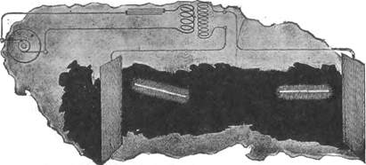


Die ideale Art, einen Saal oder ein Zimmer zu beleuchten, würde jedoch darin bestehen, dass man in demselben solche Verhältnisse herzustellen sucht, dass ein Beleuchtungskörper in ihm bewegt und irgendwohin gesetzt werden könnte und dass derselbe leuchtet, wohin man ihn auch setzen möge und ohne dass er mit irgendetwas elektrisch verbunden ist. Ich war im Stande, solche Verhältnisse herbeizuführen, indem ich in dem Zimmer ein kräftiges rasch wechselndes elektrostatisches Feld erzeugte. Zu diesem Zwecke hing ich in einiger Entfernung von der Decke ein Metallblech an isolierenden Schnüren auf und verband dasselbe mit der einen Klemme der Induktionsspule, während die andere Klemme am besten mit der Erde verbunden wurde. Oder ich hing, wie in Fig. 125 dargestellt, zwei Bleche auf, von denen jedes mit einer der Klemmen der Spule verbunden und deren Größe sorgfältig bestimmt war. Eine evakuierte Röhre kann dann in der Hand irgendwohin zwischen die Bleche geführt oder an irgendeinen Platz, selbst in eine gewisse Entfernung jenseits derselben, gehalten werden und sie wird stets leuchtend bleiben. 

In einem solchen elektrostatischen Felde kann man interessante Erscheinungen beobachten, besonders wenn die Zahl der Stromwechsel niedrig und die Spannungen außerordentlich hochgehalten werden. Außer den erwähnten Lichterscheinungen bemerkt man, dass jeder isolierte Leiter Funken gibt, wenn die Hand oder irgendein anderer Gegenstand demselben genähert wird, und diese Funken können recht kräftig sein. Wird ein großer leitender Gegenstand auf einem isolierenden Ständer befestigt und die Hand demselben genähert, so fühlt man ein Zittern, welches von der rhythmischen Bewegung der Luftmoleküle herrührt, und nimmt Lichtstörungen wahr, wenn die Hand in die Nähe eines spitzen Vorsprunges gehalten wird. Bringt man einen Telefonempfänger mit einem seiner Pole oder auch mit beiden mit einem isolierten Leiter von gewisser Größe in Berührung, so sendet das Telefon einen lauten Ton aus; es sendet ebenfalls einen Ton aus, wenn ein Stück Draht mit einem oder mit beiden Polen verbunden wird, und bei sehr kräftigen Feldern kann man einen Ton auch ohne irgendeinen Draht hören. 

Wie weit dieses Prinzip einer praktischen Anwendung fähig ist, wird die Zukunft lehren. Man könnte glauben, dass elektrostatische Effekte für solche Wirkungen in die Ferne ungeeignet seien; elektromagnetische Induktionswirkungen, falls dieselben zur Lichterzeugung verwendbar sind, könnte man für besser geeignet halten. Allerdings nehmen die elektrostatischen Wirkungen nahezu mit dem Kubus der Entfernung von der Spule ab, während die elektromagnetischen Induktionswirkungen einfach mit der Entfernung abnehmen. Wenn wir aber ein elektrostatisches Kraftfeld herstellen, so liegen die Verhältnisse ganz anders, denn dann haben wir anstatt der Differentialwirkung beider Pole deren vereinigte Wirkung. Außerdem möchte ich darauf aufmerksam machen, dass in einem wechselnden elektrostatischen Felde ein Leiter, wie z. B. eine evakuierte Röhre, den größten Teil der Energie in sich aufzunehmen strebt, während in einem wechselnden elektromagnetischen Felde der Leiter, die wenigste Energie aufzunehmen sucht, indem die Wellen mit nur geringem Verlust reflektiert werden. Dies ist einer der Gründe, weshalb es schwierig ist, eine evakuierte Röhre auf einige Entfernung durch elektromagnetische Induktion zu erregen. Ich habe Spulen von sehr großem Durchmesser und vielen Drahtwindungen gewickelt und eine Geissler'sche Röhre mit den Enden der Spule verbunden in der Absicht, die Röhre auf einige Entfernung hin zu erregen; aber auch durch die kräftigen induktiven Wirkungen, wie sie durch die Entladungen einer Leydener Flasche hervorgebracht werden können, konnte die Röhre nur auf sehr kleine Entfernungen hin erregt werden, obwohl die Dimensionen der Röhre schon einigermaßen darnach eingerichtet waren. Ich habe ferner gefunden, dass auch die kräftigsten Entladungen von Leydener Flaschen in einer geschlossenen luftleeren Röhre nur schwache Lichtwirkungen zu erregen vermochten, und auch diese Wirkungen war ich nach reiflicher Überlegung genötigt als von elektrostatischer Natur zu betrachten. 

Wie können wir dann hoffen, die erforderlichen Wirkungen mittels elektromagnetischer Induktion in der Ferne zu erzeugen, wenn wir selbst in der nächsten Nähe der Störungsquelle und unter den günstigsten Verhältnissen nur ein ganz schwaches Leuchten hervorbringen können? Allerdings kann uns, wenn wir in die Ferne wirken wollen, die Resonanz aushelfen. Wir können eine luftleere Röhre, oder welches immer die Beleuchtungsvorrichtung sein möge, mit einem isolierten System von geeigneter Kapazität verbinden und dadurch kann es sein, die Wirkung qualitativ, aber nur qualitativ, zu verstärken, da wir durch den Beleuchtungskörper hindurch nicht mehr Energie erhalten würden. So können wir durch Resonanzwirkung die erforderliche elektromotorische Kraft in einer luftleeren Röhre erhalten und schwache Lichtwirkungen erregen, wir können aber nicht genug Energie erreichen, um das Licht praktisch verwendbar zu machen, und eine auf experimentelle Ergebnisse sich gründende einfache Rechnung zeigt, dass, selbst wenn die gesamte Energie, welche eine Röhre bei einer gewissen Entfernung von der Quelle erhält, vollständig in Licht umgesetzt würde, dasselbe kaum den praktischen Anforderungen genügen würde. Hieraus ergibt sich die Notwendigkeit, mittels eines leitenden Stromkreises die Energie nach dem Orte der Umsetzung hinzuleiten. Thun wir aber dies, so können wir von den gegenwärtig verwendeten Methoden nicht erheblich abweichen und alles, was wir thun könnten, würde in einer Verbesserung der Apparate bestehen. 

Aus diesen Betrachtungen ist ersichtlich, dass, wenn man diese ideale Art der Beleuchtung in die Praxis einführen, wollte, es nur mit Anwendung elektrostatischer Wirkungen geschehen könnte. In einem solchen Falle sind die stärksten elektrostatischen Induktionswirkungen erforderlich; die verwendeten Apparate müssen daher im Stande sein, hohe elektrostatische Potentiale, deren Wert sich mit außerordentlicher Schnelligkeit ändert, zu erzeugen. Insbesondere sind hohe Frequenzen erforderlich, da praktische Erwägungen es wünschenswert machen, die Spannung nicht zu hoch zunehmen. Durch die Anwendung von Maschinen oder, allgemein gesprochen, von irgendwelchen mechanischen Apparaten lassen sich aber nur geringe Frequenzen erreichen; man muss daher zu andern Hilfsmitteln seine Zuflucht nehmen. Die Entladung eines Kondensators bietet uns ein Mittel, bei weitem höhere Frequenzen zu erreichen, als auf mechanischem Wege zu erhalten sind, und ich habe daher bei den zu obigem Zwecke angestellten Versuchen Kondensatoren angewendet. 

Wenn die Klemmen einer Induktionsspule hoher Spannung mit einer Leydener Flasche verbunden werden (Fig. 126) und die letztere in einen Stromkreis disruptiv entladen wird, so können wir den zwischen den Knöpfen spielenden Bogen als eine Quelle von Wechselströmen oder, allgemein gesprochen, von undulierenden Strömen betrachten und wir haben es dann mit dem bekannten System, bestehend aus einem Erzeuger solcher Ströme, einem mit demselben verbundenen Stromkreise und einem den Stromkreis überbrückenden Kondensator zutun. Der Kondensator ist in solchem Falle ein wirklicher Transformator, und da die Frequenz außerordentlich hoch ist, so lässt sich fast jedes Verhältnis in der Stärke der Ströme in beiden Zweigen erreichen. In Wirklichkeit ist die Analogie nicht vollkommen, denn in der disruptiven Entladung haben wir in allgemeinster Weise eine fundamentale augenblickliche Variation von verhältnismäßig niedriger Frequenz und eine darüber gelagerte harmonische Schwingung und die das Fließen der Ströme regierenden Gesetze sind in beiden Fällen nicht die gleichen. 

Bei einer derartigen Umsetzung sollte das Umsetzungsverhältnis nicht zu groß sein, denn der Verlust in dem Bogen zwischen den Knöpfen wächst mit dem Quadrat des Stromes, und wenn die Flasche durch sehr dicke und kurze Leiter entladen wird, um eine sehr rasche Oszillation zu erhalten, so geht ein sehr beträchtlicher Teil der aufgespeicherten Energie verloren. Andererseits sind aus vielen naheliegenden Gründen zu kleine Umsetzungsverhältnisse nicht praktisch. 


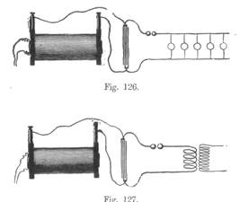


Da die transformierten Ströme in einem praktisch geschlossenen Stromkreise fließen, so sind die elektrostatischen Wirkungen notwendig klein und ich wandele sie daher in Ströme oder Wirkungen der gewünschten Art um. Solche Umwandelungen habe ich auf mehrere Arten vorgenommen. Das vorzugsweise benutzte Schema der Verbindungen ist in Fig. 127 dargestellt. Die Art der Operation ermöglicht es, mit Hilfe eines kleinen und wenig kostspieligen Apparates enorme Spannungsdifferenzen zu erzeugen, die man sonst nur mittels großer und teurer Spulen erhalten konnte. Zu diesem Zwecke braucht man nur eine gewöhnliche kleine Spule zu nehmen, mit derselben einen Kondensator und Entlader, der den Primärkreis einer kleinen Hilfsspule bildet, zu verbinden und aufwärts zu transformieren. Da die induktive Wirkung der primären Ströme außerordentlich groß ist, so braucht die zweite Spule nur verhältnismäßig wenige Windungen zu haben. Durch zweckmäßige Adjustierung der Elemente kann man bemerkenswerte Resultate erhalten. 

Bei meinen Bemühungen, die erforderlichen elektrostatischen Wirkungen in dieser Weise zu erhalten, bin ich, wie sich erwarten ließ, vielen Schwierigkeiten begegnet, die ich nach und nach überwunden habe, doch bin ich gegenwärtig noch nicht in der Lage, meine Erfahrung in dieser Richtung mitzuteilen. 

Ich glaube, dass die disruptive Entladung eines Kondensators in Zukunft eine wichtige Rolle spielen wird, denn sie eröffnet weite Perspektiven nicht nur in Bezug auf eine wirksamere Lichterzeugung nach der von der Theorie angedeuteten Richtung hin, sondern auch in vielen anderen Beziehungen. 

Seit Jahren sind die Bemühungen der Erfinder dahin gerichtet gewesen, elektrische Energie aus Wärme mit Hilfe der Thermosäule zu erhalten. Es könnte als Überhebung meinerseits erscheinen, wenn ich bemerke, dass nur wenige Leute wissen, worin die wirkliche Schwierigkeit bei der Thermosäule besteht. Dieselbe besteht nicht in der geringen "Wirksamkeit oder der geringen Leistung, obwohl dies große Nachteile sind, sondern in dem Umstände, dass die Thermosäule ihre Phylloxera hat, d.h. dass sie durch beständigen Gebrauch schlechter wird, was bis heute die Einführung derselben in die Industrie verhindert hat. Jetzt, wo alle neueren Untersuchungen mit Sicherheit auf die Verwendung von Elektrizität von außerordentlich hoher Spannung hinzuweisen scheinen, muss sich vielen von selbst die Frage aufdrängen, ob es nicht möglich sei, diese Form der Wärme in praktisch brauchbarer Form zu erhalten. Wir sind gewöhnt gewesen, eine elektrostatische Maschine als ein Spielzeug anzusehen, und verbinden damit gewissermaßen den Begriff des Unwirksamen und Unpraktischen. Nunmehr aber müssen wir anders denken, denn wir wissen jetzt, dass wir es überall mit den nämlichen Kräften zu tun haben und dass es bloß eine Frage der Erfindung geeigneter Methoden oder Apparate ist, dieselben nutzbar zu machen. 

In den gegenwärtigen Systemen elektrischer Verteilung macht es uns die Verwendung des Eisens mit seinen wunderbaren magnetischen Eigenschaften möglich, die Größe der Apparate beträchtlich zu reduzieren; trotzdem aber ist sie noch immer sehr beschwerlich. Je weiter wir im Studium der elektrischen und magnetischen Erscheinungen fortschreiten, umso mehr kommen wir zu der Überzeugung, dass die gegenwärtigen Methoden nicht von langer Dauer sein werden. Für die Erzeugung von Licht zum mindesten würden solche schweren Maschinen unnötig sein. Die erforderliche Energie ist sehr gering, und wenn Licht so wirksam erzeugt werden kann, als es theoretisch möglich erscheint, so braucht der Apparat nur eine sehr geringe Leistung zu haben. Da es höchst wahrscheinlich ist, dass die Beleuchtungsmethoden der Zukunft die Verwendung sehr hoher Spannungen bedingen werden, so erscheint es sehr wünschenswert, eine Vorrichtung, welche die Umwandlung der Energie der Wärme in Energie von der gewünschten Form ermöglicht, zu vervollkommnen. Über Versuche, welche zu diesem Zwecke unternommen worden wären, lässt sich nichts berichten, denn der Gedanke, dass Elektrizität von einigen 50000 oder 100000 Volt Spannung oder mehr, selbst wenn dieselbe erhältlich wäre, für praktische Zwecke unverwertbar sein würde, hat die Erfinder abgeschreckt, nach dieser Richtung hinzuarbeiten. 

In Fig. 126 ist ein Schema der Verbindungen dargestellt zur Umwandelung von Strömen hoher in solche niedriger Spannung mit Hilfe der disruptiven Entladung eines Kondensators. Dieses Schema habe ich oft benutzt zum Betriebe einiger Glühlampen, die im Laboratorium gebraucht wurden. Einige Schwierigkeiten machte der Entladungsfunken, doch habe ich dieselben größtenteils überwinden können. Außer dieser und der für einen zweckmäßigen Betrieb notwendigen Regulierung sind weitere Schwierigkeiten nicht aufgetreten und es war leicht, gewöhnliche Glühlampen und sogar Motoren auf diese Weise zu betreiben. Da die Linie mit Erde verbunden war, konnte man mit allen Drähten ohne jegliche Gefahr hantieren, gleichgültig wie hoch die Spannung an den Klemmen des Kondensators war. Bei diesen Versuchen wurde eine Induktionsspule hoher Spannung, welche von einer Batterie oder von einer Wechselstrommaschine betätigt wurde, zur Ladung des Kondensators benutzt; aber die Induktionsspule könnte durch einen Apparat von anderer Art ersetzt werden, der Elektrizität von so hoher Spannung zu geben vermag. Auf diese Weise können Gleichströme oder Wechselströme umgewandelt werden und in beiden Fällen können die Stromimpulse von jeder gewünschten Frequenz sein. Wenn die den Kondensator ladenden Ströme von gleicher Richtung sind und man wünscht, dass die transformierten Ströme ebenfalls einerlei Richtung haben sollen, so muss natürlich der Widerstand des Entladungsstromkreises so gewählt werden, dass keine Oszillationen stattfinden. 

Bei dem Betriebe von Apparaten nach dem obigen Schema habe ich merkwürdige Impedanz-Erscheinungen beobachtet, welche von Interesse sind. Wenn z, B. eine dicke Kupferstange gebogen wird, wie in Fig. 128 angedeutet, und im Nebenschluss dazu gewöhnliche Glühlampen angebracht werden, so können, wenn die Entladung zwischen den Knöpfen übergeht, die Lampen zum Glühen gebracht werden, obwohl sie kurzgeschlossen sind. Wird eine große Induktionsspule angewendet, so kann man leicht Knoten auf der Stange erhalten, welche durch den verschiedenen Grad der Helligkeit der Lampen sichtbar gemacht werden, wie dies in Fig. 128 roh angedeutet ist. Die Knoten sind niemals scharf markiert, sondern sie sind Maxima und Minima der längs der Stange herrschenden Spannung. Dies rührt wahrscheinlich von der Unregelmäßigkeit des Bogens zwischen den Knöpfen her. Im Allgemeinen kann man, wenn man die oben beschriebene Methode der Umwandlung von hoher zu niedriger Spannung benutzt, das Verhalten der disruptiven Entladung genau studieren. Die Knoten können auch mittels eines gewöhnlichen Cardew-Voltmeters, welches gut isoliert sein muss, ermittelt werden. Auch Geissler'sche Röhren können zwischen den Punkten der gebogenen Stange zum Leuchten gebracht werden; in diesem Falle ist es natürlich besser, kleinere Kapazitäten anzuwenden. Ich vermochte in dieser Weise eine Lampe und sogar eine Geissler'sche Röhre, die durch einen kurzen dicken Metallstab nebengeschlossen war, zum Leuchten zu bringen, und dies Resultat erschien auf den ersten Blick sehr merkwürdig. In der Tat, je dicker die Kupferstange in Fig. 128 ist, umso besser ist dies für den Erfolg der Versuche, da sie dann einen überraschenderen Anblick gewähren. Wenn Lampen mit langen dünnen Fäden benutzt werden, beobachtet man oft, dass die Fäden von Zeit zu Zeit in starke Schwingungen versetzt werden und dass die Schwingungen in den Knotenpunkten am kleinsten sind. Diese Schwingungen scheinen von einer elektrostatischen Wirkung zwischen dem Faden und der Glasbirne herzurühren. 

Bei einigen der obigen Versuche empfiehlt es sich, besondere Lampen zu benutzen, welche, wie in Fig. 129 dargestellt, einen geraden Kohlenfaden haben. Bei Verwendung einer solchen Lampe kann man eine noch seltsamere Erscheinung als die vorher beschriebene, beobachten. Die Lampe kann quer zu der Kupferstange angebracht und zum Leuchten gebracht werden, und wenn man etwas größere Kapazitäten oder, in anderen Worten, geringere Frequenzen oder kleinere scheinbare Widerstände anwendet, so kann man den Faden zu jedem gewünschten Grade des Glühens bringen. Wenn man aber den scheinbaren Widerstand erhöht, so erreicht man einen Punkt, wo verhältnismäßig wenig Strom durch die Kohle und der größte Teil desselben durch das verdünnte Gas hindurchgeht; oder vielleicht ist es richtiger zu sagen, dass sich der Strom trotz des enormen Unterschiedes im Widerstände nahezu gleichmäßig zwischen beiden Teilt, und dies würde der Wahrheit entsprechen, wenn sich nicht das Gas und der Faden verschieden verhielten. Man bemerkt dann, dass die ganze Glaskugel brillant erleuchtet ist; und die Enden der Einführungsdrähte werden glühend und sprühen oft Funken aus infolge des heftigen Bombardements; aber der Kohlenfaden bleibt dunkel. Dies ist in Fig. 129 dargestellt. Anstatt des Fadens kann man auch einen einzigen Draht, der sich durch die ganze Birne erstreckt, benutzen und dann würde die Erscheinung noch interessanter sein. 

Aus dem obigen Versuch wird ersichtlich sein, dass, wenn gewöhnliche Lampen durch die transformierten Ströme betrieben werden, vorzugsweise solche genommen werden müssen, bei denen die Platindrähte weit voneinander abstehen, und dass die angewendeten Frequenzen nicht zu gross sein dürfen, da sonst die Entladung an den Enden des Fadens oder in der Fassung der Lampe zwischen den Einführungsdrähten erfolgen und die Lampe beschädigt werden könnte. 

Indem ich Ihnen diese Resultate meiner Untersuchungen über den in Rede stehenden Gegenstand vorführte, habe ich manche Tatsachen, über welche ich mich hätte, ausführlich verbreiten können, nur vorübergehend berührt und unter den vielen Beobachtungen nur diejenigen ausgewählt, von denen ich annehmen durfte, dass sie Sie am meisten interessieren würden. Das Feld ist weit und voll kommen unerforscht und bei jedem Schritte wird eine neue Wahrheit enthüllt, eine neue Tatsache beobachtet. 

Wie weit die hier vorgetragenen Resultate praktischer Anwendungen fähig sind, muss die Zukunft entscheiden. Was die Erzeugung von Licht betrifft, so sind einige bereits erreichten Resultate ermutigend und lassen mich wagen zu behaupten, dass die praktische Lösung des Problems in der Richtung liegt, die ich anzudeuten gesucht habe. Indessen, was immer auch die unmittelbare Folge dieser Versuche sein möge, sie werden sich, hoffe ich, als ein Schritt zur weiteren Entwickelung zum Ideal und zur schließlich Vollkommenheit erweisen. Die Perspektiven, welche durch die moderne Forschung eröffnet wurden, sind so weit, dass auch der Zurückhaltende sanguinisch in die Zukunft blicken muss. Hervorragende Gelehrte betrachten das Problem der Nutzbarmachung einer Art der Strahlung ohne die andern als ein rationelles. Bei einem Apparate, der zur Erzeugung von Licht durch Umwandlung aus irgendeiner Form der Energie in diejenige des Lichtes dient, kann ein solches Resultat nie erreicht werden; denn wie beschaffen auch immer der Prozess der Erzeugung der erforderlichen Schwingungen sein möge, mag er elektrischer, chemischer oder irgendeiner anderen Natur sein, es wird nicht möglich sein, die höheren Lichtschwingungen zu erzeugen, ohne durch die niedrigeren Wärmeschwingungen hindurchzugehen. Es ist dasselbe Problem, wie einem Körper eine gewisse Geschwindigkeit mitzuteilen, ohne durch alle niedrigeren Geschwindigkeiten hindurchzugehen. Es besteht aber die Möglichkeit, Energie nicht nur in der Form von Licht, sondern auch als bewegende Kraft und als Energie von irgendeiner andern Form auf etwas direkterem Wege von dem uns umgebenden Medium zu erhalten. Es wird eine Zeit kommen, wo sich dies erfüllt, und die Zeit ist bereits gekommen, wo man solche Worte vor einer erleuchteten Zuhörerschaft äussern darf, ohne als Träumer betrachtet zu werden. Wir sausen durch den endlosen Raum mit unbegreiflicher Geschwindigkeit, alles um uns her dreht sich, alles bewegt sich, überall ist Energie. Es muss irgendeinen Weg geben, auf dem wir diese Energie in direkterer Weise nutzbar machen können. Mit dem aus dem Medium erhaltenen Lichte, mit der von ihm entlehnten Kraft, mit jeder beliebigen ohne Anstrengung aus dem ewig unerschöpflichen Vorrate erlangten Form von Energie ausgerüstet, wird dann die Menschheit mit Riesenschritten vorwärtsschreiten. Die bloße Betrachtung dieser großartigen Perspektiven erweitert unser Geist, verstärkt unsere Hoffnungen und erfüllt unsere Herzen mit höchstem Entzücken." 

