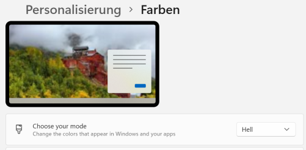

+++
tags        = ["2021", "CSS"]
description = "Light meets Dark with prefers-color-scheme"
title       = "Light and Dark"
date        = "2021-06-22T13:46:20+02:00"
series      = ["Tuning"]
+++
## prefers-color-scheme

Die Anpassung des Farbschemas einer Webseite  an Tag/Light und Nacht/Dark ist eine nützliche Sache. Hier mein erster Versuch.
Die besten Anregungen habe ich bei [web.dev][hd] gefunden.

### CSS

- main.css enthält alle Styles der Web-Seiten
- dark.css enthält alle Werte für den Dark-Mode
- light.css enthält alle Wete für den Light-Mode

in **main.css** wird das Schema aktiviert

```css {class="mw8"}
:root {
	color-scheme: light dark;
}
```

Alle Schema-Definitionen werden nach **light.css** und **dark.css** verschoben und entsprechend angepasst. Hilftreich ist dabei die Verwendung von Variablen innerhalb von CSS.
 
#### light.css
hier eine kleine Auswahl

```css
:root { 
	--anchor-color:         rgb(173,216,230);
	--background-color:     rgba(248,248,255,1);
	--background-menu:      rgb(255,250,250);
	--box-background-color: rgb(255,253,213);
	--box-border:           rgb(190,190,190);
	--box-shadow-color:     rgb(117,117,117);
	--caption-color:        rgb(72,61,139);
	--image-filter:         none;
	--link-color:           rgb(0,0,139);
	--link-hover:           rgb(30,129,176);
	--progress-bar:         rgb(0,255,0);
	--progress-background:  rgb(255,250,250);
	--shadow-opacity:       rgba(0,0,0,0.5);
	--text-color:           rgb(0,0,0);
	--th-background:        rgb(208,240,240);
	--tr-odd-background:    rgb(255,255,255);
	--tr-even-background:   rgb(232,248,248);
}
```


#### dark.css

```css
:root { /* alphabetical */
	--anchor-color:         rgb(173,216,230);
	--background-color:     rgb(0,0,0);
	--background-menu:      rgb(32,32,32);
	--box-background-color: rgb(48,48,48);
	--box-border:           rgb(190,190,190);
	--box-shadow-color:     rgb(117,117,117);
	--caption-color:        rgb(72,61,139);
	--image-filter:         grayscale(50%);
	--link-color:           rgb(250,250,0);
	--link-hover:           rgb(255,192,203);
	--progress-bar:         rgb(0,255,0);
	--progress-background:  rgb(250,245,245);
	--shadow-opacity:       rgba(0,0,0,0.5);
	--text-color:           rgb(250,250,250);
	--th-background:        rgb(0,0,0);
	--tr-odd-background: 	rgb(64,64,64);
	--tr-even-background:   rgb(0,0,0);
	}
```
### Meta
Im **header** der HTML-Seiten werden die neuen Dateien eingefügt, hier vereinfacht:

```HTML
<link rel=stylesheet href=/dark.css  media="(prefers-color-scheme: dark)">
<link rel=stylesheet href=/light.css media="(prefers-color-scheme: light)">
<link rel=stylesheet href=/main.css>
```
### weitere Anpassungen

Alle Styles in **main.css** waren noch nicht vorbereitet und mussten angepasst werden.


Alle Bilder werden im **dark**-Mode etwas grauer dargestellt, um den Blendeffekt zu reduzieren.

### Edge

Im Edge/Dev Browser lässt sich das Farb-Schema über die [Settings][ed] aktivieren und auswählen (*edge://settings/appearance* in Adressfeld kopieren). 

### Windows 11

Edge kann den Farb-Mode aus den Benutzer-Einstellungen übernehmen.  



[hd]: https://web.dev/prefers-color-scheme/ "Hello darkness, my old friend"
[ed]: https://beebom.com/customize-microsoft-edge-color-theme-picker/ ""
