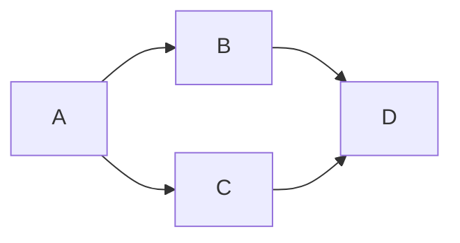

+++
tags        = ["2022"]
description = "my complex Mermaid test"
title       = "Mermaid Samples"
date        = "2022-04-18T15:07:18+01:00"
+++
## Making Mermaid Diagrams in Markdown

trying flowchart, sequence diagram, ER diagram and state diagram.
Sorry for stealing examples.

This works with mermaid render hook and an shortcode for activating the mermaid script.
<!--more-->

### Flowchart



### Sequence Diagram

````mermaid
sequenceDiagram
    participant Alice
    participant Bob
    Alice->>John: Hello John, how are you?
    loop Healthcheck
        John->>John: Fight against hypochondria
    end
    Note right of John: Rational thoughts <br/>prevail!
    John-->>Alice: Great!
    John->>Bob: How about you?
    Bob-->>John: Jolly good!
````

### Entity Relationship Diagram

````mermaid
erDiagram
    CUSTOMER ||--o{ ORDER : places
    ORDER ||--|{ LINE-ITEM : contains
    CUSTOMER }|..|{ DELIVERY-ADDRESS : uses
````

### State Diagram

````mermaid
stateDiagram
    [*] --> Still
    Still --> [*]

    Still --> Moving
    Moving --> Still
    Moving --> Crash
    Crash --> [*]
````

 <!-- must add this to activate mermade script -->